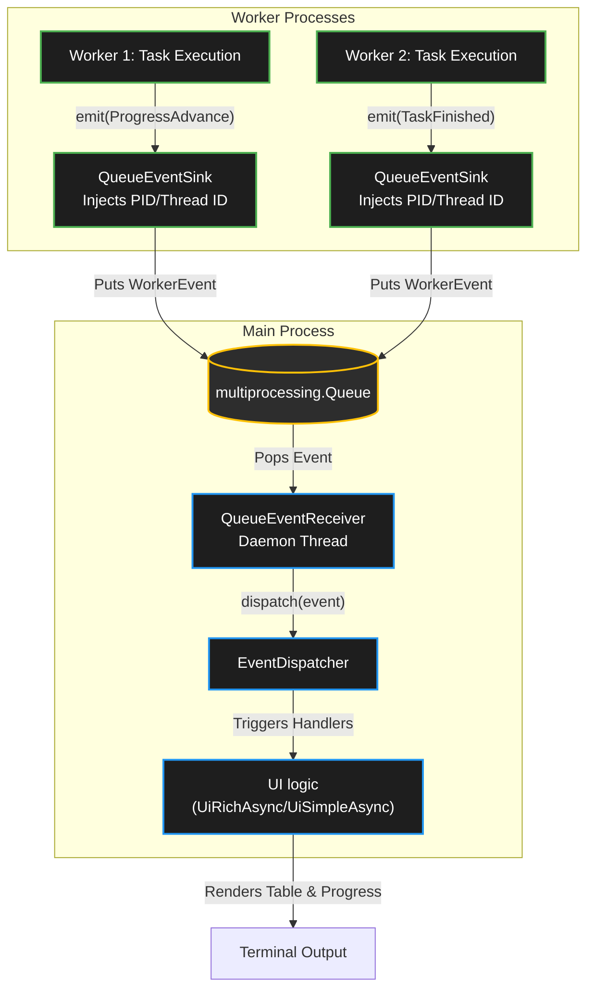
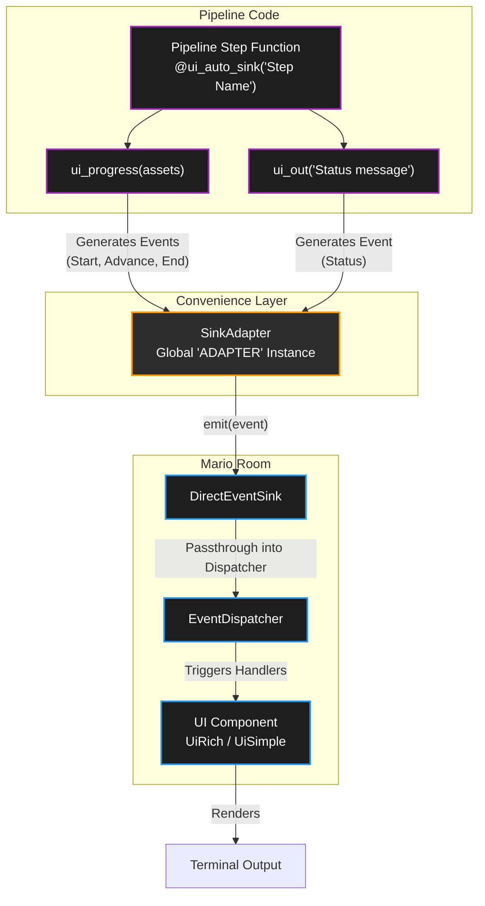

# Clunkster

GameMaker 8.2 optimization tools.

Most of the tools depend heavily on asset clustering (i.e. assigning each asset to an isolated group like "StageA", "StageB", "Common" etc.), but some use it only to group console output.

Given the architectural differences across GameMaker projects, Clunkster is organized as a set of "[examples](#examples)" that you can copy and modify. The library itself provides functions that facilitate the core logic and handle non-obvious edge cases.

Please refer to [Rationale](#rationale) and [Prerequisites](#prerequisites) to see it these tools fit your project's needs.

Non-destructive tools:

- Linter: `tree.yyd` validator (see [ex1.2](#example-12---lint-treeyyd-files))
- Linter: unused assets detector (see [ex2.2](#example-22---lint-unused-assets) and [ex3.2](#example-32---lint-unreachable-assets))
- (TODO) Linter: heavy assets detector (RAM & disk size)
- Linter: cross-cluster reference boundary validator (see [ex2.3](#example-23---lint-cross-cluster-references))
- Linter: room indirect reference validator via dependency graph (see [ex3.3](#example-33---lint-room-cluster-boundaries))

Lightly destructive tools:

- (TODO) Backgrounds minifier: strip tilesets of all unused space
- (TODO) Audio optimizer: optimize audio files via [FFmpeg](https://www.ffmpeg.org/) (see [ex4.1](#example-41---juicer-the-juice) (part of Juicer))

Super destructive tools:

- (TODO) Project crippler (Dev Build): replace assets with lightweight stubs for faster development
- Project juicer (Prod Build): convert assets into external versions and generate code for their loading (see [ex4.1](#example-41---juicer-the-juice); [Dehydration](#dehydration))

# TOC

- [Rationale](#rationale)
  - [Linters](#linters)
  - [Prerequisites](#prerequisites)
    - [[HowTo] Prerequisites - Project & Asset organization](#howto-prerequisites---project--asset-organization)
    - [[HowTo] Prerequisites - Eradicating dynamic asset referencing](#howto-prerequisites---eradicating-dynamic-asset-referencing)
    - [[HowTo] Prerequisites - Building dependency flow](#howto-prerequisites---building-dependency-flow)
    - [[HowTo] Prerequisites - Timelines...](#howto-prerequisites---timelines)
    - [[HowTo] Prerequisites - State contamination via Globals and Persistence](#howto-prerequisites---state-contamination-via-globals-and-persistence)
    - [[HowTo] Prerequisites - Proper use of the Ignore Pragma](#howto-prerequisites---proper-use-of-the-ignore-pragma)
  - [Dehydration](#dehydration)
  - [Juicing](#juicing)
  - [Pipeline architecture](#pipeline-architecture)
  - [Integration into the project](#integration-into-the-project)
- [Examples](#examples)
  - [0 - Setting up](#0---setting-up)
    - [Example 0.1 - Setup: Project](#example-01---setup-project)
    - [Example 0.2 - Setup: Widgets](#example-02---setup-widgets)
    - [Example 0.3 - Setup: Rich UI](#example-03---setup-rich-ui)
    - [Example 0.4 - Full example (pipeline excerpt)](#example-04---full-example-pipeline-excerpt)
  - [1 - Reading project](#1---reading-project)
    - [Example 1.1 - Finding assets](#example-11---finding-assets)
    - [Example 1.2 - Lint: `tree.yyd` files](#example-12---lint-treeyyd-files)
    - [Example 1.3 - Clusters](#example-13---clusters)
  - [2 - References](#2---references)
    - [Example 2.1 - Reference scanning](#example-21---reference-scanning)
    - [Example 2.2 - Lint: unused assets](#example-22---lint-unused-assets)
    - [Example 2.3 - Lint: cross-cluster references](#example-23---lint-cross-cluster-references)
  - [3 - Dependency Graph](#3---dependency-graph)
    - [Example 3.1 - Generate dependency graphs](#example-31---generate-dependency-graphs)
    - [Example 3.2 - Lint: unreachable assets](#example-32---lint-unreachable-assets)
    - [Example 3.3 - Lint: room cluster boundaries](#example-33---lint-room-cluster-boundaries)
  - [4 - Project Juicer](#4---project-juicer)
    - [Example 4.1 - Juicer: the juice](#example-41---juicer-the-juice)
    - [Example 4.2 - Juicer: running the tasks](#example-42---juicer-running-the-tasks)
    - [Example 4.3 - Juicer: generate the `.gml` files](#example-43---juicer-generate-the-gml-files)
    - [Example 4.4 - Juicer: compile and launch](#example-44---juicer-compile-and-launch)

# Rationale

GameMaker 8.2 runner is 32-bit, meaning there's a hard cap on RAM of around 4 GB. Furthermore, certain parts of the engine start having issues at even 2.5 GB of RAM consumption.

Also, such large projects take 10-15 seconds to build.

To solve this, you can split the large project into logical clusters. You have "Common" assets (`Player`, `Block`, ...), and stage-specific assets (`bStageATiles`, `StageAPostProc`, ...). So, when game is in a room from stage A, it technically doesn't require assets from Stage B.

To lighten the load, unneeded assets can be replaced with lightweight stubs right in the project.

For dev builds, the tool can nuke all assets except for ones from specified clusters. Optionally, the stubs can be made more noticeable:

- sprites and backgrounds become pink-black checkerboards
- sounds get replaced with buzz.wav and/or [fiddlesticks.mp3](https://developer.valvesoftware.com/wiki/Missing_content)

Prod builds are similar, but we add dynamic loading. The project is copied, only Common cluster is kept in the base executable. The stage-specific assets are packaged into external files ("wet" versions). When the player enters a new stage, the game dynamically loads ("hydrates") the required assets from the disk. Optionally the stubs can be made less noticeable (though you probably should still make them loud):

- sprites and backgrounds become 2x2 transparent
- sounds get replaced with null.wav

## Linters

To prevent developers from accidentally referencing a `StageB` sprite inside a `StageA` object, a dependency linter is included. It builds dependency graph based on static `.gml` and `.txt` metafile analysis.

From those dependencies, the tool can:

- find orphaned assets that are not referenced by anything
- find assets that reference other assets in disallowed clusters
- construct sets of assets referenced (both directly and indirectly) in each room, and yell at you if a room references something that it hasn't explicitly been marked to load.

## Prerequisites

1. Use this tool only if it's necessary.
   - Setting this up requires a fair bit of technical knowledge (about both GameMaker 8.2 and Python) and can be a headache. I would only recommend using this tool if your game eats more than 1.5 GB of RAM and your project takes more than 10 seconds to build.
2. Use Git - changes made by this tool are destructive and **will nuke your project** (that's literally what Clunkster is designed to do).
3. Follow good project keeping practices
   - Keep asset names clean (press broom icon on IDE's top toolbar to run required checks)
   - Keep assets belonging to certain stage in that stage's folder
   - Do not reference things from `stageA` in `stageB` objects (unless such an object is only placed in a room that guarantees both stages loaded)
   - Reference Common objects in Stage-specific, not the other way around
     - If this is unavoidable (for example, when making a stage-specific movement gimmick), use "_guard scripts_" (`if room_is_stageA() { ... }`)
   - If an asset is shared between multiple stages, then it belongs in Common cluster
   - DON'T use timelines
   - DON'T use the dastardly "Treat uninitialized variables as 0 (BAD!!!)" option
   - Minimize the number of persistent objects (they'll get tagged as referenced in every room)
4. Follow good coding practices
   - No dynamic asset referencing (tool won't acknowledge those references when building dependency graph):
     - DON'T do math on asset IDs: `draw_sprite(sprSpikeUp+2, x, y)`
     - DON'T use string execution: `execute_string("instance_create(0, 0, obj_enemy_" + string(current_level) + ")")`
     - DON'T pass assets via global variables across cluster boundaries: `global.current_boss = obj_StageB_Boss` (If Stage A reads this global, the analyzer cannot trace the dependency)
     - ^ That rule includes assigning assets to constants
   - Use the linter ignore pragma `//!clunkster: ignore` only in pure data registry scripts (like `sound_balance`), which only reference assets but don't instantiate them
   - DON'T hide room transitions behind `room` variable assignments.

Other than that, use the modern project format (`.gm82`) and Python 3.14+ ([`uv`](https://docs.astral.sh/uv/) recommended).

Following sections elaborate on prerequisites, reasons behind them, antipatterns, and how to properly fix them.

### [HowTo] Prerequisites - Project & Asset organization

Since Clunkster largely relies on splitting assets into clusters, the tool needs a way to automatically generate clusters for each asset. The easiest implementation parses `tree.yyd` files and takes the name of the root directory as a cluster name, merging those based on a provided config (see \[[ex1.3](#example-13---clusters)\]). Therefore, some amount of project keeping is required.

❌ Bad:

Sprites:

```
+Enemies
    |sprite83
    |enemy
    |enemy_burn
    |spr_stageA_specific_enemy_that_is_not_encountered_anywhere_else
+StageA
    |a_sprite_that_is_used_to_be_stageA_specific_but_is_in_fact_used_everywhere
+StageFinalBoss_2_Fix_Final
    |enemy
```

Backgrounds:

```
+Stage3
    |bgStage1
    |tileset_that_is_used_everywhere_but_its_in_this_folder_for_reason
    |bgDarkness_2000x200_semitransparent_black_with_spotlight_in_center
```

While the tool doesn't require you to name things properly, no duplicates can exist in the project. Secondly, since the folder structure now has structural value to our clusterization, you should dedicate some effort to cleaning up the project posthaste.

✅ Good:

Sprites:

```
+sprEnemies
    |sprEnemySpawner
    |sprEnemy
    |sprEnemyBurn
    |sprEnemyPoisoned
+sprStageA
    |sprFireball
+sprStageFinal
    |sprEnemyBuffed
```

Backgrounds:

```
+bgStageA
    |bStageA
+bgStageC
    |bStageC
tCommon
```

With this well organized asset tree you can write an `ALIAS` config so they get correctly assigned to their clusters:

```python
ALIAS: dict[str, list[str]] = {
    'StageA': ['sprStageA', 'bgStageA'],
    'StageC': ['bgStageC'],
    'Common': [
        'sprEnemies',
        # tCommon was automatically assigned Common cluster,
        # since it's in the root of the tree
    ],
    # ...
}
```

Even though appropriate naming of the assets isn't required, I recommend cleaning them up now. It would also be a good idea to do optimization passes before starting integrating Clunkster (unless you have an "unrunable game" situation like I had when I started making this tool).

In some cases, it might help to prepend asset names with their stage name for easy reference. However, whenever you'll have to move things around (and you _will_), renaming assets would take some effort.

> Tip: When renaming assets, use the IDE's search utility to find all occurrences of the asset name in any code.

### [HowTo] Prerequisites - Eradicating dynamic asset referencing

I have seen these quite often. Let's look at antipatterns from the [Prerequisites](#prerequisites) list.

❌ Bad: Doing maths on asset IDs.

```gml
// BAD: Analyzer only sees 'spr_player_base', misses the rest
draw_sprite(spr_player_base + current_animation, image_index, x, y)
```

This logic relies on Game Maker's internal resource order. While the order was made much more predictable in Game Maker 8.2's new save format, it is still fairly hidden and should not be used in general.

❌ Bad: String execution.

```gml
// BAD: Analyzer cannot trace the boss asset
execute_string(str_cat("instance_create(x, y, obj_boss_", current_level,")"))
```

`execute_string` requires Game Maker to parse it and build an AST at runtime, which is slow. Any dynamic code execution should generally be limited to functions like `variable_*`, and those should never reference assets.

Let's refactor those pesky examples.

✅ Good: Use explicit references...

```gml
// GOOD: All assets are explicitly declared and mapped
switch current_level {
    case "forest": instance_create(x, y, obj_boss_forest) break
    case "volcano": instance_create(x, y, obj_boss_volcano) break
}
```

✅ Good: ... or arrays

```gml
var _amb;
_amb[0] = "sfx_ambience0"
_amb[1] = "sfx_ambience1"
_amb[2] = "sfx_ambience2"
_amb[3] = "sfx_ambience3"
_amb[4] = "sfx_ambience4"

sound_loop(_amb[irandom(4)])
```

### [HowTo] Prerequisites - Building dependency flow

If you've decided to use this tool before the project has reached critical mass - this section is for you.

A healthy dependency graph flows in one direction: Stage-specific assets may reference Common assets, but Common assets cannot hardcode references to Stage-specific assets. Therefore, any sort of ubiquitous object (like the Player or World) should remain agnostic to the stages they occupy. Let's look at an example.

The Ice Stage of the game contains new special spikes that fall from the ceiling. You created a new object: `SpikeIce`. Now you have to make the Player take damage when they touch it. Sounds easy!

❌ Bad:

```gml
///Player.Step
if place_meeting(x, y, SpikeIce) {
    player_take_damage()
}
```

Now the Player directly references `SpikeIce`. The [analyzer](#example-23---lint-cross-cluster-references) will flag this, because the Player now requires the `SpikeIce` asset (and, therefore, all of it's referenced assets down the line, such as its sprite) to be loaded globally.

This can be solved in a few ways.

**Version 1 - Moving the logic from Common to Stage-specific**

Just invert the logic - make the spikes damage the player, instead of the player checking for spikes:

```gml
///IceSpike.Step
if place_meeting(x, y, Player) {
    player_take_damage()
}
```

This works (and is the best solution in many cases), but I bet this game has some other damage sources. How about we...

**Version 2 - Turn explicit reference into implicit ones**

... introduce a new Common object `ParentHazard`, and simply make the original Player logic poll for hazards, instead of specific spikes:

```gml
///Player.Step
if place_meeting(x, y, ParentHazard) {
    player_take_damage()
}
```

This is also a valid solution in many cases.

___

Now let's think of something less trivial. The Player now gains the ability to use spells, and the Ice Stage adds ice magic when picking up a certain powerup, implemented like this:

❌ Bad:

```gml
///Player.KeyPress_50

if global.Powerups[powerup_shield] {
    // Common spell
    instance_create(x, y, ProjectileShield)
}

if global.Powerups[powerup_spell_ice] {
    // Ice Stage spell
    instance_create_moving(x, y, ProjectileIcicle, 1, 270, 0.2)
}
```

You can already see the Common to Stage-specific reference. We can fix it in a few ways.

**Version 1 - Moving the logic from Common to Stage-specific**

Make picking up a spell spawn an Ice Stage-bound object `SpellIcicle`, which houses the logic for shooting it.

```gml
///SpellIcicle.KeyPress_50
with Player {
    //handle the case when player doesn't exist (dead)
    instance_create_moving(x, y, ProjectileIcicle, 1, 270, 0.2)
}
```

Now the Player doesn't know about `ProjectileIcicle`. This solution works well for small, isolated gimmicks. However, if you want to combine the logic of several Stage-specific things, keeping a perfect dependency flow might be impossible. For such cases, we introduce...

**Version 2 - Context-aware logic**

Imagine now we want to assign spells to different keys and make sure the Player can't use an icicle while having a shield up or a new multistage spell "Blizzard" (existing in a cluster `CommonNorth`, which is accessed by both Ice Stage and Tundra Stage) is active. To punish spell abuse, you decide to add logic for Player freezing to death when spamming cold spells.

This logic can be implemented as an abstract "temperature" variable on the Player, or it can be put into a controller object. Such as `ControllerSpellsNorth`:

```gml
///ControllerSpellsNorth.Create
freezing = 0

///ControllerSpellsNorth.Step
//unfreeze over time
freezing = approach(freezing, 0, 0.05)

///SpellIcicle.KeyPress_50
if room_is_ice() {
    with Player {
        //spawn the icicle projectile
        instance_create_moving(x, y, ProjectileIcicle, 1, 270, 0.2)

        //lower the chill
        other.freezing -= 10

        //check if frozen
        if other.freezing < -30 {
            player_kill(killcause_freeze)
        }
    }
}

///SpellIcicle.KeyPress_51
with Player {
    //spawn the blizzard projectile
    instance_create(x, y, ProjectileBlizzard)

    other.freezing -= 20

    if other.freezing < -30 {
        player_kill(killcause_freeze)
    }
}
```

A few things to digest from here:

1. `ControllerSpellsNorth` is now an object from `CommonNorth` as well - therefore it is totally allowed to reference any other asset from `CommonNorth`. After all, when the `CommonNorth` cluster is loaded, everything from it becomes available.
2. The new function `room_is_ice` - is not just an ordinary "location check script". It can be used as a "Context Guard" in Clunkster's analyzer. We can assign it a target cluster that this context guards behind itself (the `IceStage` in our case):

```python
CONTEXT_RULES: dict[str, set[str]] = {
    # guard for ice stage -specific things
    'room_is_ice': {
        'IceStage'
        # notice that we don't put any other more
        # "common" stages in here
    },
    # guard for things that are allowed in CommonNorth,
    # but don't require any more specific logic
    # (e.g. from IceStage)
    'room_is_north': {'CommonNorth'},
}
```

Now everything protected by this guard can freely reference any `IceStage` asset.

3. Since anything from the `CommonNorth` cluster should, logically, be available anywhere in `IceStage`, we must also define this behavior in a different config:

```python
LINT_RULES: dict[str, set[str]] = {
    # common assets cannot borrow from Stage specific folders
    'Common': {'Common'},
    'IceStage': {
        # explicitly include the common cluster
        'Common',
        # include the regional common cluster
        'CommonNorth',
        # include anything from itself
        'IceStage',
    },
    # this will make any Ice Stage room load all 3 of those clusters
}
```

Now everything in `CommonNorth` can be freely accessed by `IceStage`.

> Tip: The attentive ones among you have likely noticed that this same trick can be applied to a World object, making it useful again. I sure do hope having multiple persistent objects in the game won't become a big issue in some examples later down the line, haha.

Here's the sample implementation of those context guards.

```gml
///room_is_ice([room])
//Check whether the given room is from Ice Stage

var _room;
if argument_count == 0 {
    if global._clunkster_reg_mode return 1

    //optionally, if you are applying this tool onto an existing project,
    //you might want to temporarily bypass the guard, until you fix
    //all the initial bugs (ACTUALLY NOT RECOMMENDED)
    //return 1 //TEMP

    _room = room
}
else {
    _room = argument[0]
}

switch _room {
case rIceIntro:
case rIceBarrage:
    return 1
default:
    return 0
}
```

Notice that weird `global._clunkster_reg_mode` at the top. This is a secret tool that might come in handy later.

> Note: Clunkster is very sensitive to exact way you format the context guards. Only `if guard() { ...` will be detected. You can't use guards with parameters, you can't pair them with any sort of boolean logic, and you are not allowed to use parenthesis outside

### [HowTo] Prerequisites - Timelines...

... nobody uses timelines, right?

Convert them to `switch` statements.

```gml
///Obj.Create
time=0

///Obj.Step
time+=1

switch time {
case 20:
    ... //code on Step 20
    break
case 100:
    ... //code on Step 100
    break
}
```

### [HowTo] Prerequisites - State contamination via Globals and Persistence

Now that we've handled the easy cases, let's start on some that are less obvious (and far harder to trace, since they won't get flagged in linters).

Global variables and persistent objects can cross cluster boundaries, making them vectors for dependency leakage.

❌ Bad: Passing a specific asset through a global variable or constant.

```gml
global.next_cutscene_actor = StageB_NpcFairy
```

If the Player enters Stage A, this reference will linger, and the analyzer won't be able to catch it. If the Player instantiates this reference in Stage A:

```gml
instance_create(x, y, global.next_cutscene_actor)
```

... it could potentially produce a broken stub-asset behavior if the Stage B has been unloaded.

❌ Bad: Overusing Persistence

Persistent objects act similarly to global variables. If you do something like:

```gml
with WeatherBlizzard {
    ControllerWeather.current_weather = id
}
```

and then `WeatherBlizzard`'s home cluster of `CommonNorth` gets unloaded, you might get the same result as the previous example.

✅ Good: Pass abstract strings or enums and let a stage-specific director object spawn the correct asset locally.

```gml
///StageB_NpcFairySpawner.Step
if global.next_cutscene_actor == "fairy" {
    instance_create(x, y, StageB_NpcFairy)
    global.next_cutscene_actor = ""
}
```

✅ Good: Don't forget to register all persistent objects in `EXTRA_ROOTS`:

```python
EXTRA_ROOTS: set[str] = {
    'World'
    # ...
}
```

As a side note, all dependencies of each Extra Root will be merged with dependency graph of **every** room, so unless you wanna deal with humongous dependency graphs, keep your persistent objects minimal. Ideally, just one `World` object.

### [HowTo] Prerequisites - Proper use of the Ignore Pragma

We provide a pragma for ignoring files during dependency scans: `//!clunkster: ignore`. You should only use it on pure data registries that define metadata without instantiating objects.

❌ Bad: Skipping Your Homework

```gml
///Player.Collision_ForestLog

//eeehhh i need to convert collision with stage-specific object event
// into an End Step event + rip all that boolean logic, hide every
// call behind a guard or something ehhhh

//i dont feel like doin it :3
//!clunkster: ignore

with Player  {
    save_set_persistent("deaths", save_get("deaths") + 1)
    if global.player_skin == "knight" instance_create(x, y, Knight_BloodEmitter)
    else if instance_exists(mario_kart) instance_create(mario_kart.x, mario_kart.y+24, BloodEmitter)
    else instance_create(x, y, BloodEmitter)
    if (global.darkStage) {
        dark_gib_sound(1)
    }
    else {
        sound_play("player_death")

        // Dance specific
        if is_in_game() && !global.paused {
            if room != rDanceStage {
                camera_update()
            } else {
                dance_camera_update()
            }
        }
    }
    instance_create(0, 0, GameOver)
    instance_destroy()
}
```

❌ Bad: Putting instantiating references into _registries_ (= making them impure)

```gml
///music_register()
//Register EVERY music in here
//!clunkster: ignore

music_def_begin("musStageTutorial",0.8)
    music_def_room(rTutorial,mus_autoplay)
    music_def_room(rTutorialBoss,mus_fadeout)
    music_def_room(rFinal_Respite,mus_autoplay)
music_def_end()

///World.RoomStart

//autostart music
_l_auto=dsmap(global._mus_room_auto,room)
if not is_undefined(_l_auto) {
    _s=ds_list_size(_l_auto)

    for (_i=0;_i<_s;_i+=1) {
        _snd=ds_list_find_value(_l_auto,_i)

        // BAD!!! The reference that was hidden from the linter
        // is now being passed into the instantiating function.
        // Since Clunkster has no idea that rFinal_Respite needed
        // "musTitle", it might put it into a cluster that
        // rFinal_Respite has no access too, playing you an
        // unloaded stub asset.
        // Woe be upon you.
        music_play(_snd)
    }
}
```

✅ Good: Make registries only define pure data and non-instantiating references.

```gml
///music_register()
//Register EVERY music in here
//!clunkster: ignore

music_def_begin("musTitle")
    music_def_volume(0.8)
    music_def_og_samplerate(44100)
    music_def_loop(31*44100 + 19422, 70*44100 + 28955)

    //instead of defining autoplay logic in registry,
    // autoplay logic can be moved into a different file
    // without the "ignore" pragma

    //but we can still keep logic like "make sure the track is
    // stopped when we enter any room other than this".
    // sound_stop(...) is not an instantiating function,
    // and will work just fine if this specific sound
    // was replaced with a stub "null.wav"
    music_def_room_allowed(rTitle, rOptions, rFinal_Respite)
music_def_end()
```

✅ Good: Guard instantiating registry logic.

```gml
///music_register()
//Register EVERY music in here

// notice: the ignore is gone

if room_is_tutorial_or_final() {
    //anything shared between tutorial and final stage

    music_def_begin("musStageTutorial",0.8)
        music_def_room(rTutorial,mus_autoplay)
        music_def_room(rTutorialBoss,mus_fadeout)
        music_def_room(rFinal_Respite,mus_autoplay)

        //validate that all the rooms actually belong to the cluster
        assert(room_is_tutorial_or_final(rTutorial))
        assert(room_is_tutorial_or_final(rTutorialBoss))
        assert(room_is_tutorial_or_final(rFinal_Respite))
    music_def_end()
}
```

And, since this registry, ideally, runs only on game start, in order to not loose data that we deliberately hidden behind guard, we can introduce a little ethical hack (that doesn't ruin our cluster-boundary model).

Remember the `global._clunkster_reg_mode` from before? Here's our plan:

New script `clunkster_init`:

```gml
///clunkster_init()
global._clunkster_reg_mode = 0

//any other initialization logic might be
// autogenerated by Clunkster and added here
```

New script `clunkster_registry_begin`:

```gml
///clunkster_registry_begin()
global._clunkster_reg_mode = 1
```

New script `clunkster_registry_end`:

```gml
///clunkster_registry_end()
global._clunkster_reg_mode = 0
```

And here's how we will call the registries in Game Start:

```gml
clunkster_registry_begin()
    sound_register()
    music_register()
clunkster_registry_end()
```

And guards should intelligently silence themselves if used as context guards in registry mode, but still do proper validation if they were given an actual room:

```gml
///room_is_tutorial_or_final([room])
//Check whether the given room is from Tutorial or Final Stage

var _room;
if argument_count == 0 {
    if global._clunkster_reg_mode return 1

    _room = room
}
else {
    _room = argument[0]
}

switch _room {
case rTutorial:
case rTutorialBoss:
case rFinal_Respite:
    return 1
default:
    return 0
}
```

## Dehydration

Following terms are used:

- prepare: the process of stripping the asset from the project.
- store-dry-prod: how the stripped asset is represented inside resulting prod build (invisible stubs).
- store-dry-dev: how the stripped asset is represented inside resulting dev build (stubs that yell loudly when referenced).
- store-wet: how the actual data is stored externally.
- hydrate: the process of dynamically loading wet assets back into memory at runtime.
- dehydrate: the process of unloading the assets from memory at runtime.

___

**Backgrounds**: impactful, high priority.

- prepare: use [`gmcodec`](https://github.com/shaperones0/gmcodec) to generate `.gmbck` files.
- store-dry-prod: transparent 2x2.
- store-dry-dev: pink-black checkerboard with transparent padding
- store-wet: `.gmbck` files.
- hydrate: use `background_replace_background` to load externally.
- dehydrate: use `background_replace_background` to replace back with dry stub.

___

**Fonts**: not numerous enough to be impactful, difficult.

___

**Objects**: slightly impactful, risky (and difficult).

___

**Paths**: not impactful.

___

**Room**: not impactful, risky.

___

**Scripts**: impossible to create dynamically without big rewrites.

___

**Sprites**: impactful, high priority.

- prepare: use [`gmcodec`](https://github.com/shaperones0/gmcodec) to generate `.gmspr` files
- store-dry-prod: transparent 2x2 with same number of frames as original.
- store-dry-dev: pink-black checkerboard with transparent padding.
- store-wet: `.gmspr` files.
- hydrate: use `sprite_replace_sprite` to load externally.
- dehydrate: use `sprite_replace_sprite` to replace back with dry stub.

___

**Sounds**: very impactful, TODO.

___

**External (audio)**: impactful, high priority.

- prepare:
  - put sounds from same cluster into their folders,
  - generate a script that loads every sound as `null.wav` (or `buzz.wav`) via `sound_add_ext` on game start,
  - convert ogg into compressed (level 2 or 3)
  - wav is mostly unchanged
- store-dry-dev: `buzz.wav` for sounds and `fiddlesticks.mp3` for music.
- store-dry-prod: `null.wav` files.
- store-wet: just files sitting in their folders.
- hydrate: run the loader script.
- dehydrate: replace back with stubs.

## Juicing

For the Project Juicer our goal is to "build" a game maker project. The goal is, simply put, to copy most of the project, apply dehydration to the assets that require it.

To elaborate:

- we only do dehydration of sprites, backgrounds and external audio (builtin sounds aren't implemented yet (TODO), other asset types aren't impactful enough to bother)
- dynamic loading of sprites and backgrounds presents us with a few game maker bugs that we need to address:
  - objects don't update their mask after mask's sprite got replaced, simple `maks_index=mask_index` in Room Start does the trick
  - rooms' backgrounds stretch flag is compile-time, meaning that rooms that use it must have a dynamic backgrounds resize code added into the Room Creation Code:

```gml
if background_width[0]>0 && background_height[0]>0 {
    background_xscale[0]=room_width/background_width[0]
    background_yscale[0]=room_height/background_height[0]
}
```

- since for some projects Juicing is the only way to run the project, builds must be fast:
  - processing tasks must support caching
  - asset dirs without processing can be symlinked
  - heavy tasks (audio compression, image encoding) should be multiprocessed
  - copy tasks (numerous but IO-bound) can be put into threading

The requirements for "fast builds" are implemented in Clunkster through the system of "tasks" and "caching". Those are done in the library's respective pipeline abstraction (`task.py`, `cache.py`), as well as the [Juicer classes example](#example-41---juicer-the-juice).

With that said, the project building strategy becomes:

- do an `iterdir` on project root
  - if element is a folder
    - if it belongs to an asset type that needs processing (smartly handle data folder)
      - generate processing/copy tasks
    - otherwise
      - check if this folder is allowed to exist in the project
      - symlink
  - if element is a file
    - check if this file is allowed to exist in the project
    - copy (without a task)
- execute the tasks (notice which things are tasks and which aren't)
  - multiprocessing for processing tasks (image encoding, audio compression)
  - threading for copy tasks
  - the rest can happen synchronously right at the task generation

Speaking of building, one more note on how the built project is structured. By default, wet assets are stored in `data/chunks/<cluster>/<whatever was their original path relative to the project root>`

## Pipeline architecture

Pipeline has a number of systems and abstractions that run all throughout examples and might appear confusing. The deal behind was about solving few annoying issues:

1. We should be able to run our asset processing logic in parallel, for more expensive / IO-bound operations, without loosing the ability to report on the progress (status prints, progress bars).
2. We should be able to have different interfaces (CLI mode / TUI mode (not implemented yet but would be rad af)).

Following outlines our solutions. Most of them are housed in [pipeline folder](https://github.com/shaperones0/clunkster/tree/main/clunkster/pipeline).

- `task.py`: Task encapsulates information needed for processing logic, input and output files for build caching and house the `execute` method that actually does the thing.
- `cache.py`: The aforementioned build cache system. The build cache is saved into JSON file. Tasks, whose output files are already present, and input files haven't changed, are skipped.
- `executor`: Module that houses fancy task execution logic - they take list of tasks and run them in a special way.
  - `executor/base.py`: Shared util logic.
  - `executor/mp.py`: Multiprocessing executor.
  - `executor/thread.py`: Threading executor.
- `events`: Workers need to output information (task started/finished, progress), and in order to bring that information into the main thread (UI) we use a system of events.
  - `events/event.py`: The actual event models.
  - `events/dispatcher.py`: Event dispatchers. In order to handle events user must register callbacks for each event type. Dispatchers only exist on the main process.
  - `events/sink.py`: Sink are where workers send their events. Regular `DispatchEventSink` simply passes through the event to underlying dispatcher. However, concurrent executors implement their own sinks:
    - threading executor's sinks share a lock, which they activate before invoking underlying dispatcher.
    - multiprocessing executor's sink doesn't send events to dispatcher, but rather to underlying queue, shared with the main thread. Main process polls this queue in a separate thread (main thread of the main process handles waiting for futures to finish their job), and from this queue things are pushed into the dispatcher (see `QueueEventReceiver`).
  - `events/context.py`: This is the unified execution context given to workers. Contains their event sink and whatever other metadata belogs there.

The overall architecture can be expressed by this diagram:



With simple and justifiable systems out of the way, next things might seem questionable:

- `ui`: UI abstraction system.
  - `ui/base.py`: Abstract UI class, automatically registers its own methods as dispatcher's handlers.
  - `ui/simple.py`: Simple UI implementation, using prints.
  - `ui/adapter.py`: Given synchronous pipeline steps an easy interface over events and dispatchers via `ui_out` (print replacement) and `ui_progress` (progress bar over a sequence).

UI abstraction architecture can also be expressed in a diagram:



You'll encounter UI implementation with [rich](https://rich.readthedocs.io/en/latest/introduction.html) a bit later.

Full example of a synchronous pipeline step can be found here: [ex0.4](#example-04---full-example-pipeline-excerpt).

Full example of concurrents is available in the Project Juicer section of [Examples](#examples).

## Integration into the project

In order to integrate Clunkster into your project you'll have to create a couple of GML scripts. Some of them will be autogenerated in Project Juicer and its derivatives.

Here's the static scripts that you'll have to add:

- `clunkster_init()`: Initialized Clunkster's variables.
- `clunkster_room_start()`: Clunkster's Room Start event, cleans up all unused assets.
- `clunkster_room_goto(target_room)`: A `room_goto` replacement that ensures all assets are loaded for target room.
- `clunkster_registry_begin()`: Toggles registry mode on.
- `clunkster_is_reg()`: Returns registry mode status.
- `clunkster_registry_end()`: Toggles registry mode off.

And the following scripts will be autogenerated in this step. You should still add them - we'll be filling them in this step, instead of creating. In raw project those are usually empty.

- `clunkster_gen_type()`: Returns `"dev"` or `"prod"` in a built project. Returns `""` in the raw source project.
- `clunkster_gen_init_audio()`: Initializes audio stubs.
- `clunkster_gen_get_room_clusters(target_room)`: Populates the required cluster map.
- `clunkster_gen_hydrate_cluster(cluster_name)`: Loads assets.
- `clunkster_gen_dehydrate_cluster(cluster_name)`: Unloads assets (replaces them with dry stubs to reduce RAM).
- `clunkster_gen_validate_ctx()`: Validation script that runs on Game Start and checks that [context guards](#howto-prerequisites---building-dependency-flow) correctly guard their rooms.

Following describes the base implementation of those scripts, as well as some tips on where they should be called.

1. `clunkster_init()` - Initializes Clunkster logic

```gml
///clunkster_init()
//Initialize Clunkster globals

global.__clunk_reg_mode=0
global.__clunk_active_clusters=ds_map_create()
global.__clunk_req_clusters=ds_map_create()

clunkster_gen_validate_ctx()
```

See example of proper Game Start logic below.

2. `clunkster_room_start()` - System's Room Start event, responsible for cleaning up unloaded assets.

```gml
///clunkster_room_start()
//Clunkster's Room Start event
//Cleanup cluster no longer needed for this room

var _key,_next;
_key=ds_map_find_first(global.__clunk_active_clusters)

while is_string(_key) {
    _next=ds_map_find_next(global.__clunk_active_clusters,_key)
    if not ds_map_exists(global.__clunk_req_clusters,_key) {
        //this cluster is no longer needed
        clunkster_gen_dehydrate_cluster(_key)
        ds_map_delete(global.__clunk_active_clusters,_key)
    }
    _key=_next
}
```

Put it at Room Start, in some `World`-like object.

3. `clunkster_room_goto(target_room)` - Interceptor of `room_goto` calls, which is responsible for loading any asset required by target room.

```gml
///clunkster_room_goto(room)
//Intercept room_goto and load necessary clusters

ds_map_clear(global.__clunk_req_clusters)
clunkster_gen_get_room_clusters(argument0)

var _key;
_key=ds_map_find_first(global.__clunk_req_clusters)
repeat ds_map_size(global.__clunk_req_clusters) {
    if !ds_map_exists(global.__clunk_active_clusters,_key) {
        //must be loaded
        clunkster_gen_hydrate_cluster(_key)
        ds_map_add(global.__clunk_active_clusters,_key,1)
    }
    _key=ds_map_find_next(global.__clunk_req_clusters,_key)
}

room_goto(argument0)
```

Notice that you'll have to replace every `room_goto` call with this function, and never use any other methods of room change.

Next are registry-related functions.

4. `clunkster_registry_begin()` - Switch registry mode ON.

```gml
///clunkster_registry_begin()

global.__clunk_reg_mode=1
```

5. `clunkster_registry_end()` - Switch registry mode OFF.

```gml
///clunkster_registry_end()

global.__clunk_reg_mode=0
```

6. `clunkster_is_reg()` - Check whether in registry mode.

```gml
///clunkster_is_reg()
//Check whether in registry mode

return global.__clunk_reg_mode
```

And finally, the autogenerated scripts. In raw project they remain mostly empty.

7. `clunkster_gen_type()`

```gml
///clunkster_gen_type()
//Returns the type of project.
//Expect "dev" for builds with no dynamic asset loading
//Expect "prod" for builds with dynamic asset loading
//Expect "" for raw projects

//This script is autogenerated by Clunkster.

return ""
```

8. `clunkster_gen_init_audio()`

```gml
///clunkster_gen_init_audio()
//Initialize audio sources with stubs
//sound_add_ext("null.wav",kind,streamed,"snd_actual")

//This script is autogenerated by Clunkster.
```

9. `clunkster_gen_get_room_clusters(target_room)`

```gml
///clunkster_gen_get_room_clusters(target_room)
//Get clusters that must be loaded for given room
//Populates global.__clunk_req_clusters

//This script is autogenerated by Clunkster.
```

10. `clunkster_gen_hydrate_cluster(cluster_name)`

```gml
///clunkster_gen_hydrate_cluster(cluster_name)
//Loads data from specified cluster in one block

//This script is autogenerated by Clunkster.
```

11. `clunkster_gen_dehydrate_cluster(cluster_name)`

```gml
///clunkster_gen_dehydrate_cluster(cluster_name)
//Unloads data from specified cluster in one block

//This script is autogenerated by Clunkster.
```

12. `clunkster_gen_validate_ctx()`

```gml
///clunkster_gen_validate_ctx()
//Validates context guards

//This script is autogenerated by Clunkster.
```

What are the registries? Basically, if you wanna have some values associated with a externalized resource, that should be applied whenever its loaded, you can simply put such data in a `dsmap` and add some logic for loading and applying those values.

For example, if you have some values associated with audio source (like volume balancing, original sample rate, loops), you can create a registry, like this `sndreg`:

`sndreg_init`:

```gml
///sndreg_init()
//Initialize sound registry

global._sndreg=ds_map_create()
global._sndlist=ds_list_create()
```

`sndreg_ext` - Fills in all data of an audio at once:

```gml
///sndreg_ext(snd,og_samplerate=44100,vol=1,[loopstart,loopend=-1])
//Fill in all params at once

//reg
if !ds_map_exists(global._sndreg,argument0+":REG") {
    ds_list_add(global._sndlist,argument0)
    dsmap(global._sndreg,argument0+":REG",1)
}

//rate
//NOTE: I recommend avoiding unit_samples and unit_seconds, as FMOD's
// native format is unit_unitary
var _rate;if argument_count>1 _rate=argument[1] else _rate=44100
dsmap(global._sndreg,argument0+":RATE",_rate)

//vol
var _vol;if argument_count>2 _vol=argument[2] else _vol=1
dsmap(global._sndreg,argument0+":VOL",_vol)

//loop
if argument_count>3 {
    dsmap(global._sndreg,argument0+":LA",argument[3])
    var _le;
    if argument_count>4 _le=argument[4] else _le=-1
    dsmap(global._sndreg,argument0+":LB",_le)
}
```

`sndreg_populate` - This is where you define all those values:

```gml
///sndreg_populate()
//Populate sound registry with necessary sound data

sndreg_ext("block_break",44100)
sndreg_ext("block_change",44100,0.8)
sndreg_ext("boss_hit",44100,0.8)
sndreg_ext("cherry_trap",44100,0.6)
sndreg_ext("get_item",44100)
sndreg_ext("glass",44100)

if room_is_ice_stage() {
    sndreg_ext("ice_melt",44100)
}
```

`sndreg_apply` - Apply registry values to a sound:

```gml
///sndreg_apply(snd)
if sound_exists(argument0) {
    //volume
    var _vol;_vol=dsmap(global._sndreg,argument0+":VOL")
    if is_undefined(_vol) _vol=1
    sound_volume(argument0,_vol)

    //loop
    var _ls;_ls=dsmap(global._sndreg,argument0+":LA")
    if not is_undefined(_ls) {
        var _le;_le=dsmap(global._sndreg,argument0+":LB")
        if is_undefined(_le) _le=-1

        //scale samplerate to account for compression
        var _scaled_start,_scaled_end;
        _scaled_start=sndreg_scale_sample(argument0,_ls)

        if _le==-1 {
            _scaled_end=sound_get_length(argument0,unit_samples)
        }
        else {
            _scaled_end=sndreg_scale_sample(argument0,_le)
        }
        sound_set_loop(
            argument0,
            _scaled_start,_scaled_end,unit_samples
        )
    }
}
else {
    show_error(str_ins(
        "sndreg_apply: Sound '%' doesn't exist",argument0
    ),0)
}
```

`sndreg_apply_all` - Apply registry values to all registered sounds; this one should be used right after registry population, if project type is raw.

```gml
///sndreg_apply_all()
//Apply audio stuff to all sounds

var _i,_ac,_snd;
_ac=ds_list_size(global._sndlist)
for (_i=0;_i<_ac;_i+=1) {
    _snd=ds_list_find_value(global._sndlist,_i)
    sndreg_apply(_snd)
}
```

This allows us to write a clean Game Start logic:

```gml
clunkster_registry_begin()
sndreg_populate()
clunkster_registry_end()
if clunkster_gen_type() == "" {
    //all audio is internal and loaded, run audio balance
    sndreg_apply_all()
}
else {
    //we are in 'dev' or 'prod' build, generate stubs
    clunkster_gen_init_audio()
}
```

# Examples

Examples are generated from the [main pipeline file](https://github.com/shaperones0/clunkster/blob/master/main.py), and represent parts of the workflow for the game this tool was initially build for. The structure is assumed to follow [Verve GM8.2 Engine](https://github.com/iwVerve/Verve-GM82-Engine) for IWBTG fangames, though changing it should be easy.

## 0 - Setting up

This is the setup section. It covers settings up the project, linters, and other pipeline shims. Of these, mandatory ones are:

- Project
- Widgets

### Example 0.1 - Setup: Project

Setup project and linter session.

Mandatory stuff includes setting few important variables:

- `PROJECT`: project root path, where game's `.gm82` files is stored
- `LINT`: linter session (contains violation queue, resolvers, etc.)

```py
from pathlib import Path

from clunkster import lint as my_lint
from clunkster import project as my_proj

PROJECT: Path
LINT = my_lint.LinterSession()


def global_set_project(project_root: Path) -> None:
    """Convenience function for initializing the project."""
    global PROJECT
    PROJECT = project_root
    my_proj.set_root(PROJECT)

global_set_project(Path('path/to/the/project'))
```

Notice the humble helper function `global_set_project` and what it does. Calling `my_proj.set_root(PROJECT)` is very important.

### Example 0.2 - Setup: Widgets

Populate abstract widgets used down the line.

Since most of UI is abstracted, examples don't use `print` or other methods of output, but rather more abstract `ui_out` and other shims from the same module. More complicated UI requires abstract widgets. The ones required by the tool are outlined here, as well as their sample implementation with `print`.

```py
import collections.abc as col
from abc import ABC, abstractmethod
from typing import override

class WidgetRenderer(ABC):
    """Base class for our widget renderers."""

    @abstractmethod
    def render_table(
        self,
        table: col.Sequence[col.Sequence[str]],
        *,
        title: str | None = None,
    ) -> None:
        """Render a 2D sequence of strings.

        Assumed ``table[0]`` contains the headers.
        """


class WidgetRendererSimple(WidgetRenderer):
    """Renders widgets using standard Python print statements."""

    @override
    def render_table(
        self,
        table: col.Sequence[col.Sequence[str]],
        *,
        title: str | None = None,
    ) -> None:
        if not table or len(table) < 2:  # noqa: PLR2004
            return

        corner_label = table[0][0]
        headers = table[0][1:]

        if title:
            print(f'\n--- {title} ---')

        print(corner_label, *headers)

        for row_data in table[1:]:
            row_label = row_data[0]
            cells = row_data[1:]

            formatted_row = [
                cell or ' ' * len(header)
                for header, cell in zip(headers, cells, strict=True)
            ]

            print(f'[{row_label!s:>10}]:', '|'.join(formatted_row))

WIDGET: WidgetRenderer


def global_widget_renderer(renderer: WidgetRenderer) -> None:
    """Set widget renderer."""
    global WIDGET
    WIDGET = renderer

global_widget_renderer(WidgetRendererSimple())
```

With that out of the way you may start the [first real examples](#example-11---finding-assets). However, I recommend reading a bit about the [pipeline architecture](#pipeline-architecture), which should give you proper understanding on what to do if things don't work out.

### Example 0.3 - Setup: Rich UI

The other UI option is [rich](https://github.com/textualize/rich).

We have to add the widget renderer and `Ui` implementations.

```py
import collections.abc as col
import dataclasses
import threading
from typing import override

from rich import console as r_console
from rich import live as r_live
from rich import table as r_table
from rich import text as r_text

from clunkster.pipeline.events import event as my_event
from clunkster.pipeline.ui import base as my_ui_base

# see ex0.2
class WidgetRenderer: ...
def global_widget_renderer(): ...

# TODO remove big width param
CON = r_console.Console(width=1024)


def rich_render_row_progress(
    text: str, current: int, total: int, width: int = 60, color: str = 'white'
) -> r_text.Text:
    """Renders a string where the background color acts as a progress bar."""
    pct = 0.0 if total <= 0 else min(1.0, current / total)

    text_padded = text.ljust(width)[:width]
    fill_len = int(width * pct)

    rich_text = r_text.Text('--- ')
    if fill_len > 0:
        rich_text.append(
            text_padded[:fill_len], style=f'bold black on {color}'
        )
    if fill_len < width:
        rich_text.append(text_padded[fill_len:], style='bold white on default')

    return rich_text


class UiRich(my_ui_base.Ui):
    """Rich UI."""

    @override
    def __init__(self, step_name: str, width: int = 60) -> None:
        """Initialize Rich UI."""
        self.step_name = step_name
        self.width = width

        # state
        self.task_id = '...'
        self.current = 0
        self.total = 1
        self.statuses: list[str] = []

        self.live = r_live.Live(
            self._generate_renderable(), refresh_per_second=10
        )

    def _generate_renderable(self) -> r_console.Group:
        # title + progress
        bar_text = f'Task: {self.task_id} '
        header = rich_render_row_progress(
            bar_text, self.current, self.total, self.width
        )

        logs = r_text.Text('\n'.join(self.statuses), style='dim')

        return r_console.Group(header, logs)

    def _update(self) -> None:
        self.live.update(self._generate_renderable())

    @override
    def on_task_started(self, e: my_event.TaskStarted) -> None:
        self.task_id = e.task_id
        self._update()

    @override
    def on_progress_start(self, e: my_event.ProgressStart) -> None:
        self.current = 0
        self.total = e.total
        self._update()

    @override
    def on_progress_advance(self, e: my_event.ProgressAdvance) -> None:
        self.current = e.completed
        self._update()

    @override
    def on_progress_completed(self, e: my_event.ProgressCompleted) -> None:
        self.current = self.total  # force fill
        self._update()

    @override
    def on_status(self, e: my_event.Status) -> None:
        self.statuses.append(f'| {e.text}')
        self._update()

    @override
    def on_task_finished(self, e: my_event.TaskFinished) -> None:
        self.current = self.total
        self._update()

    @override
    def start(self) -> None:
        self.live.start()

    @override
    def stop(self) -> None:
        self.live.stop()


@dataclasses.dataclass(slots=True)
class WorkerState:
    """Worker current state."""

    task_id: str = 'Idle'
    current: int = 0
    total: int = 1


class UiRichAsync(my_ui_base.UiAsync):
    """Rich UI. Concurrents version."""

    def __init__(self, step_name: str, width: int = 120) -> None:
        """Initialize Concurrent Rich UI."""
        self.step_name = step_name
        self.width = width

        self.total_current = 0
        self.total_target = 1
        self.workers: dict[str, WorkerState] = {}

        self._lock = threading.Lock()
        self.live = r_live.Live(
            self._generate_renderable(), refresh_per_second=10
        )

    def _generate_renderable(self) -> r_console.Group:
        # must be called within lock

        # progress in header
        header_text = (
            f' {self.step_name} ({self.total_current}/{self.total_target}) '
        )
        header_bar = rich_render_row_progress(
            header_text, self.total_current, self.total_target, self.width
        )

        # worker table
        table = r_table.Table(show_header=False, width=self.width, expand=True)
        table.add_column('Worker')
        table.add_column('Task')

        for worker_id, state in sorted(self.workers.items()):
            row_bar = rich_render_row_progress(
                state.task_id, state.current, state.total, self.width - 2
            )
            table.add_row(worker_id, row_bar)

        return r_console.Group(header_bar, table)

    def _update(self) -> None:
        # must be called within lock
        self.live.update(self._generate_renderable())

    @override
    def update_total_progress(self, current: int, total: int) -> None:
        """Called by main thread to update the overall step progress."""
        with self._lock:
            self.total_current = current
            self.total_target = total
            self._update()

    def _get_worker(self, worker_id: str) -> WorkerState:
        # must be called within lock

        if worker_id not in self.workers:
            self.workers[worker_id] = WorkerState()
        return self.workers[worker_id]

    @override
    def on_task_started(self, e: my_event.TaskStarted) -> None:
        with self._lock:
            worker = self._get_worker(e.worker_id)
            worker.task_id = e.task_id
            worker.current = 0
            self._update()

    @override
    def on_progress_start(self, e: my_event.ProgressStart) -> None:
        if e.worker_id == 'main':
            self.update_total_progress(0, self.total_target)

        with self._lock:
            worker = self._get_worker(e.worker_id)
            worker.total = max(1, e.total)
            self._update()

    @override
    def on_progress_advance(self, e: my_event.ProgressAdvance) -> None:
        if e.worker_id == 'main':
            self.update_total_progress(e.completed, self.total_target)
            return

        with self._lock:
            worker = self._get_worker(e.worker_id)
            worker.current = e.completed
            self._update()

    @override
    def on_task_finished(self, e: my_event.TaskFinished) -> None:
        if e.worker_id == 'main':
            self.update_total_progress(self.total_target, self.total_target)
            return

        with self._lock:
            worker = self._get_worker(e.worker_id)
            worker.current = worker.total  # fill on finish
            self._update()

    @override
    def start(self) -> None:
        self.live.start()

    @override
    def stop(self) -> None:
        self.live.stop()


class WidgetRendererRich(WidgetRenderer):
    """Renders widgets using the Rich library."""

    def __init__(self, console: r_console.Console | None = None) -> None:
        """Set up Rich Widget renderer.

        :param console: Existing Rich console.
        """
        self.console = console or CON

    @override
    def render_table(
        self,
        table: col.Sequence[col.Sequence[str]],
        *,
        title: str | None = None,
    ) -> None:
        if not table or len(table) < 2:  # noqa: PLR2004
            return

        headers = table[0]

        rich_table = r_table.Table(
            f'[bold]{headers[0]}[/bold]', *headers[1:], title=title, padding=0
        )

        for row_data in table[1:]:
            rich_table.add_row(*row_data)

        self.console.print(rich_table)

global_widget_renderer(WidgetRendererRich())
```

### Example 0.4 - Full example (pipeline excerpt)

Following is the full example of integrating UI logic into a pipeline step, taken from `main.py` (where you can look for a more thorough example as well).

```py
import time

from clunkster.pipeline.ui import base as my_ui_base
from clunkster.pipeline.ui import simple as my_ui_simple
from clunkster.pipeline.ui.adapter import ui_auto_sink, ui_out, ui_progress

CLS_UI: type[my_ui_base.Ui] = my_ui_simple.UiSimple
CLS_UI_ASYNC: type[my_ui_base.UiAsync] = my_ui_simple.UiSimpleAsync

@ui_auto_sink('Example step', cls_ui=CLS_UI)
def main_example() -> None:
    """Example pipeline step."""
    # no need to report start of the step
    ui_out('Good weather up there')
    time.sleep(1)
    ui_out('Makes me forget about my job: counting to 10')
    for number in ui_progress(range(10)):
        time.sleep(0.5)
        ui_out('Number', number)
    ui_out('Clear?!! No way')
    # no need to report end of the step
```

## 1 - Reading project

This section is about discovering assets from project files, doing initial validations and assigning clusters to the assets.

### Example 1.1 - Finding assets

Let's start with some simple scanning.

Clunkster already provides utils for scanning builtin assets and single-file external assets (such as audio for `gm82snd`). However, registering those external assets is left as a task for the user.

Also notice the global variables:

- `PROJECT` should point at the folder where project's `.gm82` file is located.
- `LINT` is the error accumulator that is used by tools down the line.

The convenience function `global_set_project` is provided to set up given path as the source project root.

```py
import collections.abc as col
import dataclasses
from abc import ABC
from pathlib import Path
from typing import override

from clunkster import asset as my_asset
from clunkster import lint as my_lint
from clunkster.asset import Asset

# see ex0.1
PROJECT: Path = ...
LINT: my_lint.LinterSession = ...

@dataclasses.dataclass(frozen=True, slots=True)
class AssetExtAudio(my_asset.AssetSingleFile, ABC):
    """Generic external audio asset."""


@dataclasses.dataclass(frozen=True, slots=True)
class AssetExtBgm(AssetExtAudio):
    """External background music asset."""

    @override
    @classmethod
    def type_name(cls) -> str:
        return 'DATA_BGM'

    @override
    @classmethod
    def type_globs(cls) -> tuple[str, ...]:
        return '*.ogg', '*.mp3', '*.wav'

    @override
    @classmethod
    def type_get_dir_rel(cls) -> Path:
        return Path('data') / 'music'


@dataclasses.dataclass(frozen=True, slots=True)
class AssetExtSfx(AssetExtAudio):
    """External sound effect asset (kind 0)."""

    @override
    @classmethod
    def type_name(cls) -> str:
        return 'DATA_SFX'

    @override
    @classmethod
    def type_globs(cls) -> col.Iterable[str]:
        return ('*.wav',)

    @override
    @classmethod
    def type_get_dir_rel(cls) -> Path:
        return Path('data') / 'sounds'


@dataclasses.dataclass(frozen=True, slots=True)
class AssetExtSfx3(AssetExtAudio):
    """External sound effect asset (kind 3)."""

    @override
    @classmethod
    def type_name(cls) -> str:
        return 'DATA_SFX3'

    @override
    @classmethod
    def type_globs(cls) -> col.Iterable[str]:
        return '*.ogg', '*.mp3'

    @override
    @classmethod
    def type_get_dir_rel(cls) -> Path:
        return Path('data') / 'sounds'

CLUSTERABLE_ASSETS: tuple[type[my_asset.AssetHasPath], ...] = (
    my_asset.Sprite,
    my_asset.Background,
    my_asset.Sound,
    my_asset.Path,
    my_asset.Script,
    my_asset.Font,
    my_asset.Object,
    my_asset.Room,
    AssetExtBgm,
    AssetExtSfx,
    AssetExtSfx3,
)

assets: list[Asset] = []

for asset_type in CLUSTERABLE_ASSETS:
    # check if given asset type exist in the project
    if not asset_type.type_is_used(PROJECT):
        continue

    # type_discover_all handles the discovery of all assets per
    #  asset type.
    assets.extend(asset_type.type_discover_all(PROJECT))

print(f'Discovered {len(assets)} total assets.')
```

I recommend checking the resulting `assets` array for any weirdness in debug before going further.

### Example 1.2 - Lint: `tree.yyd` files

Now we must check integrity of `tree.yyd` files and asset names.

Asset discovery and clusterization is based on scanning `tree.yyd` files, so we have to ensure that they have no duplicate folders.

This example also serves as an introduction to Clunkster's linter system. It implements things like accumulating errors to printed in a list view, sorting and grouping them by type, verbose output, etc.

In order to make reports as thorough as possible, Clunkster provides various classes and mixins for customizing violation scope:

- `LinterViolation`: base violation, not bound to any file or asset
- `LinterViolationMessage`: adds a short error message
- `LinterViolationFile`: binds error to a specific file
- `LinterViolationLocated`: binds error to a location in the file
- `LinterViolationAsset`: mixin that binds error to a specific asset

For linting `tree.yyd` files we want to check that:

1. all asset names are unique: handled by `LintTreeDuplicateAsset`, this violation is abstract and isn't really bound to a specific file, since duplicate assets can exist across multiple types.
2. no duplicate folders in tree: handled by `LintTreeDuplicateFolder`, this violation is done only within same asset type and is bound to a location in specific `tree.yyd` file.

All the linter violations should have their ID (like A100) and severity. Default violation processor would print info messages, turn warn messages into warnings and raise errors.

Since any inconsistency will cause big issues in the pipeline, every violation is marked as error.

```py
import collections
import collections.abc as col
from pathlib import Path
from typing import override

from clunkster import asset as my_asset
from clunkster import lint as my_lint
from clunkster import project as my_proj
from clunkster.parse import tree as my_parse_tree
from clunkster.text import location as my_location

# see ex0.1
PROJECT: Path = ...
LINT: my_lint.LinterSession = ...

# see ex1.1
class AssetExtAudio: ...
class AssetExtBgm: ...
class AssetExtSfx: ...
class AssetExtSfx3: ...

class LintTreeDuplicateFolder(
    my_lint.LinterViolationLocated, my_lint.LinterViolationMessage
):
    """Duplicate ``tree.yyd`` folder violation."""

    rule = 'T100'
    severity = my_lint.Severity.ERROR

    def __init__(
        self, *, node: my_parse_tree.TreeNode, location: my_location.Location
    ) -> None:
        """Initialize violation.

        :param node: Offending tree node.
        :param location: Source location.
        """
        self.tree_node = node
        self.loc = location
        super().__init__()

    @override
    @property
    def location(self) -> my_location.Location:
        return self.loc

    @override
    @property
    def message(self) -> str:
        thing = 'Folder' if self.tree_node.is_folder else 'Asset???'
        return f"Duplicate {thing}: '{self.tree_node.name}'"


class LintTreeDuplicateAsset(my_lint.LinterViolationMessage):
    """Duplicate asset violation."""

    rule = 'T101'
    severity = my_lint.Severity.ERROR

    def __init__(self, dupes: col.Iterable[str], message_pref: str) -> None:
        """Initialize violation.

        :param dupes: Names of the duplicate assets.
        :param message_pref: Message prefix.
        """
        super().__init__()
        self.dupes = tuple(dupes)
        self.message_pref = message_pref

    @override
    @property
    def message(self) -> str:
        return f'{self.message_pref}: {" ".join(self.dupes)}'

CLUSTERABLE_ASSETS: tuple[type[my_asset.AssetHasPath], ...] = (
    my_asset.Sprite,
    my_asset.Background,
    my_asset.Sound,
    my_asset.Path,
    my_asset.Script,
    my_asset.Font,
    my_asset.Object,
    my_asset.Room,
    AssetExtBgm,
    AssetExtSfx,
    AssetExtSfx3,
)

def asset_lint_tree(asset_cls: type[my_asset.AssetBuiltin]) -> None:
    tree_file = asset_cls.type_get_tree_file(PROJECT)
    line_map = my_proj.line_map(tree_file)
    seen_children: dict[str, set[str]] = {}

    for node in my_parse_tree.nodes(my_proj.lines(tree_file)):
        # format the tuple into path string (e.g., "/Player/SkinA")
        path_str = '/' + '/'.join(node.parent_path)

        if path_str not in seen_children:
            seen_children[path_str] = set()

        if node.name in seen_children[path_str]:
            loc_line = node.line_num
            loc_column = node.depth + 1  # uses tab characters
            LINT.push(
                LintTreeDuplicateFolder(
                    node=node,
                    location=my_location.Location(
                        file=tree_file,
                        loc_line=loc_line,
                        loc_column=loc_column,
                        loc_index=line_map.get_abs_index(
                            loc_line, loc_column
                        ),
                    ),
                )
            )
        else:
            seen_children[path_str].add(node.name)

# check that there are no duplicates
asset_names: set[str] = set()
for asset_type in CLUSTERABLE_ASSETS:
    # check if given asset type exist in the project
    if not asset_type.type_is_used(PROJECT):
        continue

    # populate namespace
    assets_from_index = list(asset_type.type_discover_names(PROJECT))
    assets_set = set(assets_from_index)
    if len(assets_from_index) != len(assets_set):
        dupes = [
            item
            for item, count in collections.Counter(
                assets_from_index
            ).items()
            if count > 1
        ]
        LINT.push(
            LintTreeDuplicateAsset(
                dupes=dupes, message_pref='Duplicate assets in one type'
            )
        )
    inters = asset_names.intersection(assets_set)
    if inters:
        LINT.push(
            LintTreeDuplicateAsset(
                dupes=inters,
                message_pref='Duplicate assets across multiple types',
            )
        )
    asset_names.update(assets_set)

    # collect errors before parsing tree.yyd
    LINT.consume()

    # check tree.yyd for builtin assets
    if not issubclass(asset_type, my_asset.AssetBuiltin):
        continue

    # get assets from index, validate uniqueness
    asset_lint_tree(asset_type)

# collect all errors
LINT.consume()
```

### Example 1.3 - Clusters

Generate clusters.

Once we validated assets and trees, we can do cluster generation. We'll look at the top level folder name. In order to merge things like `"StageA"` and `"stage_a"` into single cluster `"StageA"`, we'll use the alias system.

Now, the alias dictionary can become quite large, so I added additional validation. Now we detect unused or extra names.

Also, this script has a neat table output for clusters per asset type, It can be useful to discern where exactly any extra names are located.

Also, since this stage is used as an actual part of the pipeline, it uses the fancy printing shims.

```py
import collections.abc as col
from pathlib import Path
from typing import override

from clunkster import asset as my_asset
from clunkster import lint as my_lint
from clunkster.asset import Asset

# see ex0.1
PROJECT: Path = ...
LINT: my_lint.LinterSession = ...

# see ex0.2
class WidgetRenderer: ...
WIDGET: WidgetRenderer = ...

# see ex1.1
class AssetExtAudio: ...
class AssetExtBgm: ...
class AssetExtSfx: ...
class AssetExtSfx3: ...

ALIAS: dict[str, list[str]] = {
    'StageA': [
        'stage_a',
        'stageA',
        'StageA Music',
        # ...
    ],
    'StageB': [
        'objStageB',
        'rStageB',
        # ...
    ],
    'Common': [
        'Backgrounds',
        'Blocks',
        'Default',
        # ...
    ],
    # ...
}
ALIAS_INV: dict[str, str]


def global_set_alias(alias: dict[str, list[str]]) -> None:
    """Global alias setting helper."""
    global ALIAS, ALIAS_INV
    ALIAS = alias

    ALIAS_INV = {}
    for name, clusters in ALIAS.items():
        for cluster in clusters:
            if cluster in ALIAS_INV:
                raise ValueError(f"Invalid ALIAS (duplicate: '{cluster}')")
            ALIAS_INV[cluster] = name

def asset_cluster_raw(asset: my_asset.AssetHasPath) -> str:
    """Get asset's initial cluster before aliasing."""
    return asset.tree_path[0] if asset.tree_path else 'Common'


def asset_cluster(asset: my_asset.Asset) -> str:
    """Get asset's cluster."""
    if isinstance(asset, my_asset.AssetHasPath):
        cluster = asset_cluster_raw(asset)
        alias = ALIAS_INV.get(cluster)
        return cluster if alias is None else alias
    return 'Unknown?'

class LintAliasMismatch(my_lint.LinterViolationMessage):
    """Alias mismatch violation."""

    rule = 'A100'
    severity = my_lint.Severity.WARNING

    def __init__(self, dupes: col.Iterable[str], message_pref: str) -> None:
        """Initialize violation.

        :param dupes: Duplicate alias names.
        :param message_pref: Message prefix.
        """
        super().__init__()
        self.dupes = tuple(dupes)
        self.message_pref = message_pref

    @override
    @property
    def message(self) -> str:
        return f'{self.message_pref}: {" ".join(self.dupes)}'

CLUSTERABLE_ASSETS: tuple[type[my_asset.AssetHasPath], ...] = (
    my_asset.Sprite,
    my_asset.Background,
    my_asset.Sound,
    my_asset.Path,
    my_asset.Script,
    my_asset.Font,
    my_asset.Object,
    my_asset.Room,
    AssetExtBgm,
    AssetExtSfx,
    AssetExtSfx3,
)

assets: list[Asset] = []

# ALIAS linter: find existing names in ALIAS
lint_existing_aliases: set[str] = set()
for name, clusters in ALIAS.items():
    for cluster in clusters:
        lint_existing_aliases.add(cluster)
        lint_existing_aliases.add(name)

# this will help us generate the table below
table_type_to_clusters: dict[type[Asset], list[str]] = {}

# ALIAS linter: find actually used names in ALIAS
lint_used_aliases: set[str] = set()
for asset_type in CLUSTERABLE_ASSETS:
    if not asset_type.type_is_used(PROJECT):
        continue

    cluster_set: set[str] = set()
    for asset in asset_type.type_discover_all(PROJECT):
        # add both generated cluster and its alias
        cluster = asset_cluster(asset)
        lint_used_aliases.add(asset_cluster_raw(asset))
        lint_used_aliases.add(cluster)

        cluster_set.add(cluster)

        assets.append(asset)

    table_type_to_clusters[asset_type] = list(cluster_set)

# generate the table
clusters_all = {
    name
    for clusters in table_type_to_clusters.values()
    for name in clusters
}
clusters_all_sorted = sorted(clusters_all)
asset_types = list(table_type_to_clusters.keys())
table: list[list[str]] = [
    ['Cluster', *(at.type_name() for at in asset_types)]
]

# 3. Add rows: One row per cluster
for cluster_name in clusters_all_sorted:
    row = [cluster_name]

    for asset_type in asset_types:
        if cluster_name in table_type_to_clusters[asset_type]:
            row.append(asset_type.type_name())
        else:
            row.append('')

    table.append(row)

WIDGET.render_table(table, title='Clusters')

# lint
lint_unused_aliases = lint_existing_aliases - lint_used_aliases
lint_extra_aliases = lint_used_aliases - lint_existing_aliases
if lint_unused_aliases:
    LINT.push(
        LintAliasMismatch(
            dupes=lint_unused_aliases, message_pref='Unused aliases'
        )
    )
if lint_extra_aliases:
    # after the initial project setup, I'd upgrade this to raise
    LINT.push(
        LintAliasMismatch(
            dupes=lint_extra_aliases, message_pref='Extra aliases'
        )
    )
LINT.consume()
LINT.assert_empty()
```

Keep using the table thing until all aliases are gone.

## 2 - References

This section is about finding asset references in `.gml` files, and running validations based on them.

### Example 2.1 - Reference scanning

Reference scanner.

In order to run dependency linters, we need to scan the actual references. We'll use [`pyahocorasick`](github.com/WojciechMula/pyahocorasick) library to make it decently fast.

Text occurrences found like this reflect occurrences in static code, but with some exceptions (strings, comments). Filtering through such is implemented in Clunkster.

Also, for pure data registry scripts (like `sound_balance`), which, technically reference every asset, but don't instantiate them, we added a special directive: `//!clunkster: ignore`. Add it in any GML scripts that should be skipped.

```py
import collections.abc as col
import dataclasses
from pathlib import Path

from ahocorasick import Automaton

from clunkster import asset as my_asset
from clunkster import lint as my_lint
from clunkster import project as my_proj
from clunkster.analyze import scan_dep as my_scan_dep
from clunkster.asset import Asset
from clunkster.pipeline.ui.adapter import ui_out, ui_progress
from clunkster.text import location as my_location

# see ex0.1
PROJECT: Path = ...
LINT: my_lint.LinterSession = ...

# see ex1.1
class AssetExtAudio: ...
class AssetExtBgm: ...
class AssetExtSfx: ...
class AssetExtSfx3: ...

# see ex1.3
def asset_cluster_raw(): ...
def asset_cluster(): ...

def asset_scannables(asset: Asset, project_root: Path) -> col.Iterable[Path]:
    """Get asset's scannable code files."""
    if isinstance(asset, my_asset.Object):
        yield asset.get_object_metadata_file(project_root)
        yield asset.get_object_gml_file(project_root)
    elif isinstance(asset, my_asset.Room):
        # easier to rglob
        dir_room = asset.get_room_folder(project_root)
        yield from dir_room.rglob('*.txt')
        yield from dir_room.rglob('*.gml')
    elif isinstance(asset, my_asset.Script):
        yield asset.get_script_gml_file(project_root)
    # add finders for new asset types

@dataclasses.dataclass(frozen=True, slots=True)
class Dependency:
    """Full dependency data to be used in graph building."""

    location: my_location.Location
    source_asset: my_asset.Asset
    target_asset: my_asset.Asset
    contexts: tuple[str, ...]

# see ex1.3
assets: list[Asset] = ...

automaton = Automaton()
for asset in assets:
    automaton.add_word(asset.name, asset.name)
automaton.make_automaton()

dependencies: list[Dependency] = []

name2asset = {asset.name: asset for asset in assets}
total_matches = 0
scans = tuple(
    (asset, file_path)
    for asset in assets
    for file_path in asset_scannables(asset, PROJECT)
)

for asset, file_path in ui_progress(scans):
    text = my_proj.read(file_path)
    line_map = my_proj.line_map(file_path)
    matches: list[my_scan_dep.DependencyMatch] = list(
        my_scan_dep.scan(
            text,
            automaton.iter(text),
        )
    )

    total_matches += len(matches)
    for match in matches:
        line, column = line_map.get_line_col(match.idx)
        dependencies.append(
            Dependency(
                location=my_location.Location(
                    file=file_path,
                    loc_index=match.idx,
                    loc_line=line,
                    loc_column=column,
                ),
                source_asset=asset,
                target_asset=name2asset[match.target],
                contexts=match.contexts,
            )
        )

ui_out(f'Found {total_matches} total dependency references.')
```

### Example 2.2 - Lint: unused assets

Find and report assets that are never referenced by anything.

Removing unused assets is a quick way to clean up a project. We can do this with a simple set difference: Total Assets minus Used Assets. However, this will not catch isolated reference loops (e.g., A references B, B references A, but neither is used by the game).

Also, some things that are indirectly referenced by the engine (like with rooms and `room_goto_next()`) might still get reported.

Take the output of this with a grain of salt.

```py
import collections.abc as col
from abc import ABC
from pathlib import Path
from typing import Self, override

from clunkster import asset as my_asset
from clunkster import lint as my_lint
from clunkster.asset import Asset
from clunkster.pipeline.ui.adapter import ui_out, ui_progress

# see ex0.1
PROJECT: Path = ...
LINT: my_lint.LinterSession = ...

# see ex1.1
class AssetExtAudio: ...
class AssetExtBgm: ...
class AssetExtSfx: ...
class AssetExtSfx3: ...

# see ex1.3
def asset_cluster_raw(): ...
def asset_cluster(): ...

def asset_sort_key(asset: Asset) -> tuple[str, ...]:
    """Get asset's sort key."""
    if isinstance(asset, my_asset.AssetHasPath):
        return type(asset).type_name(), '/'.join(asset.tree_path), asset.name

    return type(asset).type_name(), asset.name

# see ex2.1
class Dependency: ...

class LintAssetCluster(my_lint.LinterViolationAsset, ABC):
    """Group linter list output by assets' clusters."""

    @override
    @classmethod
    def format_many(
        cls, errors: col.Iterable[Self], *, verbose: bool = False
    ) -> str:
        errors = list(errors)
        if not errors:
            return f'=== {cls.rule}: no issues'

        # group by clusters
        cluster_errors: dict[str, list[Self]] = {}
        for err in errors:
            asset = err.asset
            cluster_errors.setdefault(asset_cluster(asset), []).append(err)

        lines = [
            f'=== {cls.rule}: {len(errors)} issue(s) across '
            f'{len(cluster_errors)} clusters:'
        ]
        for cluster, errors in sorted(cluster_errors.items()):
            lines.append(f'\n=== {cluster} ===')

            # sort
            errors.sort(key=lambda e: asset_sort_key(e.asset))
            for err in errors:
                if verbose:
                    lines.append(err.format_verbose())
                else:
                    lines.append(f'  {err.format_li()}')

        return '\n'.join(lines)

class LintUnused(LintAssetCluster):
    """Unused asset violation."""

    rule = 'U100'
    severity = my_lint.Severity.WARNING

    def __init__(self, asset: Asset) -> None:
        """Initialize violation.

        :param asset: The unused asset.
        """
        super().__init__()
        self._asset = asset

    @override
    @property
    def asset(self) -> Asset:
        return self._asset

# see ex1.3
assets: list[Asset] = ...

# see ex2.1
dependencies: list[Dependency] = ...

all_assets = {asset.name: asset for asset in assets}

# populate used set from dependencies
used_asset_names: set[str] = set()
for dep in ui_progress(dependencies):
    # ignore self-references
    if dep.source_asset.name == dep.target_asset.name:
        continue
    used_asset_names.add(dep.target_asset.name)

orphan_names = set(all_assets.keys()) - used_asset_names
for name in orphan_names:
    LINT.push(LintUnused(all_assets[name]))

# unwrap
violations_cnt = LINT.consume(LintUnused)
if violations_cnt:
    ui_out(f'\nFound {violations_cnt} violations.')
else:
    ui_out('\nSomehow all clear...')
```

### Example 2.3 - Lint: cross-cluster references

Validate cluster boundaries.

Simple check of clusters on both ends of dependency edge will filter out the majority of "stageA object referenced stageB asset" cases.

However, this iteration (and following linters) have a few special rules:

1. Most clusters are allowed to reference only themselves and Common cluster, but some may need to reference certain more localized "nonlocal" cluster. Such as when one collab maker creates multiple stages, and has many common scripts and util objects shared between them, but, technically, not between the rest of the collab. Such rules should be defined in `LINT_RULES`.

2. We allow special context guard scripts in a form of:

```
if room_is_stageA() {
    ...
}
```

Those guards allow references to any foreign cluster inside them. Such guards must be defined in `CONTEXT_RULES`. Read more on those in the [GML chapter](#integration-into-the-project).

3. References to rooms are severed. Since the only way to meaningfully "instantiate" a room is to go there, for all intents and purposes whatever references a room doesn't really depend on it.

Make sure to fill in the `LINT_RULES` and `CONTEXT_RULES` - they'll be used by future linters as well.

Note: I strongly advise clearing out the project to satisfy this linter (even though this might take a lot of effort). Skipping it would make using Project Juicer and other project-transforming tools a nightmare of hidden bugs.

```py
from pathlib import Path
from typing import override

from clunkster import asset as my_asset
from clunkster import lint as my_lint
from clunkster.asset import Asset
from clunkster.pipeline.ui.adapter import ui_out, ui_progress
from clunkster.text import location as my_location

# see ex0.1
PROJECT: Path = ...
LINT: my_lint.LinterSession = ...

LINT_RULES: dict[str, set[str]] = {
    # common assets cannot borrow from Stage specific folders
    'Common': {'Common'},
    # example of a stage that shares assets with another
    # "StageB": {"StageB", "StageA", "Common"},
}

CONTEXT_RULES: dict[str, set[str]] = {
    'room_is_stageA': {'StageA'},
    'room_is_stageB': {'StageB'},
    'room_is_final': {'StageX', 'StageY', 'StageZ'},
    # ...
}

# see ex1.1
class AssetExtAudio: ...
class AssetExtBgm: ...
class AssetExtSfx: ...
class AssetExtSfx3: ...

# see ex1.3
def asset_cluster_raw(): ...
def asset_cluster(): ...

# see ex2.1
class Dependency: ...

# see ex2.2
class LintAssetCluster: ...

class LintCrossref(
    my_lint.LinterViolationLocated,
    LintAssetCluster,
    my_lint.LinterViolationMessage,
):
    """Cross-cluster reference violation."""

    rule = 'C100'
    severity = my_lint.Severity.ERROR

    def __init__(self, dependency: Dependency) -> None:
        """Initialize the violation.

        :param dependency: Offending dependency edge.
        """
        super().__init__()
        self._dependency = dependency

    @override
    @property
    def location(self) -> my_location.Location:
        return self._dependency.location

    @override
    @property
    def asset(self) -> Asset:
        return self._dependency.source_asset

    @override
    @property
    def message(self) -> str:
        # hack: use message (appended to the end) for dep repr.
        target = self._dependency.target_asset
        ctx = self._dependency.contexts
        ctx_str = f' [Contexts: {", ".join(ctx)}]' if ctx else ''
        return f'{target.name} [{asset_cluster(target)}]{ctx_str}'

# see ex2.1
dependencies: list[Dependency] = ...

for dep in ui_progress(dependencies):
    source = dep.source_asset
    target = dep.target_asset

    source_cluster = asset_cluster(source)
    target_cluster = asset_cluster(target)

    # remove deps to room
    if isinstance(target, my_asset.Room):
        continue

    # get permissions from lint rules
    allowed_targets = set(
        LINT_RULES.get(source_cluster, {source_cluster, 'Common'})
    )

    # expand permissions based on script guards
    for ctx in dep.contexts:
        if ctx in CONTEXT_RULES:
            granted_primaries = CONTEXT_RULES[ctx]

            # look up what the primary cluster knows
            for primary in granted_primaries:
                expanded_permissions = LINT_RULES.get(
                    primary, {primary, 'Common'}
                )
                allowed_targets.update(expanded_permissions)

    # check for structural violations
    if target_cluster not in allowed_targets:
        LINT.push(LintCrossref(dep))

# you can turn on verbose=True
violations_cnt = LINT.consume(LintCrossref)
if violations_cnt:
    ui_out(f'\nFound {violations_cnt} violations.')
else:
    ui_out('Clear!!!')
```

## 3 - Dependency Graph

This section is about building a graph out of dependencies, and running checks based on more advanced usage tracing.

### Example 3.1 - Generate dependency graphs

Build dependency graph.

Reference scanner gave us a set of dependency edges, from which we can build a dependency graph. Graphs are done via [`rustworkx`](https://github.com/Qiskit/rustworkx).

Our main application of this graph would be finding a set of used assets in each room, and feeding that info into linters.

There's two thing that makes this entire process a bit messy.

First, our context guards depend on the current room being processed. This means, that rooms have slightly different graphs from each other. The cleanest (but far not optimal) way of doing this is to create different graphs for different sets of clusters.

Second, persistent objects. We can't cleanly trace where those objects travel through the game, so we have to make a few compromises. We'll allow only 2 types of persistent objects:

1. Highly localized objects (like room transitions), that don't instantiate state-specific assets beyong their spawn room. I think it'd be wise to validate that those objects are in Common cluster, for safety.

2. Ubiquitous `World` object, which is present in every room. We mark those objectsi in `EXTRA_ROOTS`, so they get artificially added into the reachability sets.

Note: even though we calculate graphs for each room, saving them is optional. Beyond reachability set generation, they are only used in better output of second cross-reference linter down the line. If saving graphs ever becomes a bottleneck you may omit those and only calculate the `reachability_map: dict[str, set[str]]`

```py
import dataclasses

import rustworkx as rx

from clunkster import asset as my_asset
from clunkster.asset import Asset
from clunkster.pipeline.ui.adapter import ui_out, ui_progress

# see ex2.3
LINT_RULES: dict[str, set[str]] = ...

# see ex2.3
CONTEXT_RULES: dict[str, set[str]] = ...

EXTRA_ROOTS: set[str] = {
    'World'
    # ...
}

# see ex1.1
class AssetExtAudio: ...
class AssetExtBgm: ...
class AssetExtSfx: ...
class AssetExtSfx3: ...

# see ex1.3
def asset_cluster_raw(): ...
def asset_cluster(): ...

# see ex2.1
class Dependency: ...

@dataclasses.dataclass
class RoomGraph:
    """Bundle of room graph data."""

    room: my_asset.Room
    reachable_names: set[str]
    graph: rx.PyDiGraph
    name2index: dict[str, int]

# see ex1.3
assets: list[Asset] = ...

# see ex2.1
dependencies: list[Dependency] = ...

def build_graph(
    active_clusters: set[str],
) -> tuple[rx.PyDiGraph, dict[str, int]]:
    g = rx.PyDiGraph()

    asset_name2index: dict[str, int] = {}

    for asset in assets:
        # add_node() returns the rx's assigned node id
        asset_name2index[asset.name] = g.add_node(asset.name)

    e = 0
    for dep in dependencies:
        source_idx = asset_name2index[dep.source_asset.name]
        target_idx = asset_name2index[dep.target_asset.name]

        # delete references to rooms
        if isinstance(dep.target_asset, my_asset.Room):
            continue

        # context guards (nested guards intersect)
        if dep.contexts:
            edge_can_execute = True

            for raw_ctx in dep.contexts:
                # get granted clusters for guard

                # room must satisfy this guard to proceed deeper into
                #   the nested guards
                granted_clusters = CONTEXT_RULES.get(raw_ctx)
                if granted_clusters and not active_clusters.intersection(
                    granted_clusters
                ):
                    edge_can_execute = False
                    break

            if not edge_can_execute:
                continue

        e += 1
        g.add_edge(source_idx, target_idx, None)

    return g, asset_name2index

# group rooms by their allowed clusters
cluster_groups: dict[frozenset[str], list[my_asset.Room]] = {}

for asset_room in assets:
    if not isinstance(asset_room, my_asset.Room):
        continue
    room_cluster = asset_cluster(asset_room)
    allowed_clusters = LINT_RULES.get(
        room_cluster, {room_cluster, 'Common'}
    )
    cluster_groups.setdefault(frozenset(allowed_clusters), []).append(
        asset_room
    )

ui_out('Clusterset to rooms:')
for cluster_set, rooms in cluster_groups.items():
    ui_out(*cluster_set)
    for room in rooms:
        ui_out(' ', room.name)
    ui_out()

room_graph_data: dict[str, RoomGraph] = {}

# process clustersets
ui_out('Building graphs:')
for cluster_set, rooms in cluster_groups.items():
    graph, name_to_index = build_graph(set(cluster_set))

    # resolve persistent root indices
    persistent_idx = [
        name_to_index[p] for p in EXTRA_ROOTS if p in name_to_index
    ]

    ui_out('- ' + ' '.join(sorted(cluster_set)))
    for room in ui_progress(rooms):
        room_name = room.name
        if room_name not in name_to_index:
            continue

        room_idx = name_to_index[room_name]

        # get direct descendants
        reachable_indices = rx.descendants(graph, room_idx)
        # inject persistent stuff
        for p_idx in persistent_idx:
            # add descendants of persistent stuff
            reachable_indices.update(rx.descendants(graph, p_idx))

            # add the thing itself
            reachable_indices.add(p_idx)

        reachable_names = {graph[idx] for idx in reachable_indices}
        room_graph_data[room_name] = RoomGraph(
            room=room,
            reachable_names=reachable_names,
            graph=graph,
            name2index=name_to_index,
        )
```

### Example 3.2 - Lint: unreachable assets

Identify unreachable assets.

With our newly build reachability map we can indentify which assets are never referenced in any room. This would solve closed loops we've been skipping over in the simpler linter.

```py
from pathlib import Path

from clunkster import asset as my_asset
from clunkster import lint as my_lint
from clunkster.asset import Asset
from clunkster.pipeline.ui.adapter import ui_out

# see ex0.1
PROJECT: Path = ...
LINT: my_lint.LinterSession = ...

# see ex2.3
LINT_RULES: dict[str, set[str]] = ...

# see ex2.3
CONTEXT_RULES: dict[str, set[str]] = ...

# see ex3.1
EXTRA_ROOTS: set[str] = ...

# see ex1.1
class AssetExtAudio: ...
class AssetExtBgm: ...
class AssetExtSfx: ...
class AssetExtSfx3: ...

# see ex2.1
class Dependency: ...

# see ex3.1
class RoomGraph: ...

# see ex2.2
class LintUnused: ...

# see ex1.3
assets: list[Asset] = ...

# see ex2.1
dependencies: list[Dependency] = ...

# see ex3.1
room_graph_data: dict[str, RoomGraph] = ...

# master set
all_used_names: set[str] = set()

# extract reachability map
reachability_map = {
    room_name: data.reachable_names
    for room_name, data in room_graph_data.items()
}

# add reachable descendants
for reachable_set in reachability_map.values():
    all_used_names.update(reachable_set)

# we must explicitly add the Rooms (edges to them
#  were severed in the previous step)
all_used_names.update(
    asset.name for asset in assets if isinstance(asset, my_asset.Room)
)

# detect unuseds
for asset in assets:
    if asset.name in all_used_names:
        continue
    LINT.push(LintUnused(asset))

violations_cnt = LINT.consume(LintUnused)
if violations_cnt:
    ui_out(f'\nFound {violations_cnt} unreachable assets.')
else:
    ui_out('\nClear??? omg')
```

### Example 3.3 - Lint: room cluster boundaries

Validate room and their dependencies clustering boundaries.

Final step of linting process is validating cluster boundaries on rooms as a whole.

Note 1: this tool is intended to be used only after resolved every issue raised by simpler crossref linter.

Note 2: this tool will output a lot of violations for each offending dependency edge, therefore some deduction is required in order to pinpoint the exact offenders. Also, I recommend re-running the tool after each fix.

```py
import collections.abc as col
from pathlib import Path
from typing import Self, override

import rustworkx as rx

from clunkster import asset as my_asset
from clunkster import lint as my_lint
from clunkster.asset import Asset
from clunkster.pipeline.ui.adapter import ui_out, ui_progress

# see ex0.1
PROJECT: Path = ...
LINT: my_lint.LinterSession = ...

# see ex2.3
LINT_RULES: dict[str, set[str]] = ...

# see ex2.3
CONTEXT_RULES: dict[str, set[str]] = ...

# see ex3.1
EXTRA_ROOTS: set[str] = ...

# see ex1.1
class AssetExtAudio: ...
class AssetExtBgm: ...
class AssetExtSfx: ...
class AssetExtSfx3: ...

# see ex1.3
def asset_cluster_raw(): ...
def asset_cluster(): ...

# see ex2.2
def asset_sort_key(): ...

# see ex2.1
class Dependency: ...

# see ex3.1
class RoomGraph: ...

class LintCrossrefGraph(my_lint.LinterViolationAsset):
    """Room cluster boundary violation."""

    rule = 'C101'
    severity = my_lint.Severity.ERROR

    def __init__(
        self,
        room: my_asset.Room,
        room_allowed_clusters: set[str],
        target_name: str,
        target_cluster: str,
        trace: str,
    ) -> None:
        """Initialize the violation.

        :param room: Offending room.
        :param room_allowed_clusters: Room's allowed clusters.
        :param target_name: Offending asset name.
        :param target_cluster: Offending asset's cluster.
        :param trace: Trace info.
        """
        super().__init__()
        self.room = room
        self.room_allowed_clusters = room_allowed_clusters
        self.target_name = target_name
        self.target_cluster = target_cluster
        self.trace = trace

    @override
    @property
    def asset(self) -> Asset:
        return self.room

    @override
    @classmethod
    def format_many(
        cls, errors: col.Iterable[Self], *, verbose: bool = False
    ) -> str:
        errors = list(errors)
        if not errors:
            return f'=== {cls.rule}: no issues'

        # group by clusters
        cluster_errors: dict[str, list[Self]] = {}
        rooms_allowed_clusters: dict[str, set[str]] = {}
        for err in errors:
            room = err.room
            cluster_errors.setdefault(asset_cluster(room), []).append(err)
            if room.name not in rooms_allowed_clusters:
                rooms_allowed_clusters[room.name] = err.room_allowed_clusters

        lines = [
            f'=== {cls.rule}: {len(errors)} issue(s) across '
            f'{len(cluster_errors)} clusters:'
        ]
        for cluster, errors in sorted(cluster_errors.items()):
            lines.append(f'\n=== {cluster} ===')
            # sort
            errors.sort(key=lambda e: asset_sort_key(e.room))
            # group by room
            room_errors: dict[str, list[Self]] = {}
            for err in errors:
                room = err.room
                room_errors.setdefault(room.name, []).append(err)
            for room, errors in sorted(room_errors.items()):
                lines.append(f'Violations in Room: {room}')
                lines.append(
                    f'-- Allowed Clusters: '
                    f'{" ".join(rooms_allowed_clusters[room])}'
                )

                # group by target
                target_errors: dict[str, list[Self]] = {}
                for err in errors:
                    target_errors.setdefault(err.target_name, []).append(err)
                for target, errors in sorted(target_errors.items()):
                    lines.append(f'  {target} [{errors[0].target_cluster}]')
                    lines.extend(f'    {err.trace}' for err in errors)

        return '\n'.join(lines)

# see ex1.3
assets: list[Asset] = ...

# see ex2.1
dependencies: list[Dependency] = ...

# see ex3.1
room_graph_data: dict[str, RoomGraph] = ...

# asset clusters lookup
asset_to_cluster: dict[str, str] = {
    asset.name: asset_cluster(asset) for asset in assets
}
total_violations = 0

for rg in ui_progress(list(room_graph_data.values())):
    room_cluster = asset_to_cluster.get(rg.room.name)
    if not room_cluster:
        continue

    allowed_clusters = LINT_RULES.get(
        room_cluster, {room_cluster, 'Common'}
    )

    illegal_assets: list[str] = []
    for reached_name in rg.reachable_names:
        reached_cluster = asset_to_cluster.get(reached_name)
        if reached_cluster and reached_cluster not in allowed_clusters:
            illegal_assets.append(reached_name)

    if not illegal_assets:
        continue

    room_idx = rg.name2index[rg.room.name]
    illegal_assets.sort(key=lambda name: asset_to_cluster.get(name, ''))

    # pre-resolve active persistent root ids
    active_persistent_roots = [
        (p_name, rg.name2index[p_name])
        for p_name in EXTRA_ROOTS
        if p_name in rg.name2index
    ]

    for illegal_name in illegal_assets:
        target_idx = rg.name2index[illegal_name]
        target_cluster = asset_to_cluster.get(illegal_name, 'Unknown')
        total_violations += 1

        path_found = False

        # trace 1 - room contamination
        room_paths = rx.dijkstra_shortest_paths(
            rg.graph, room_idx, target_idx
        )
        if target_idx in room_paths:
            path_names = [rg.graph[idx] for idx in room_paths[target_idx]]
            LINT.push(
                LintCrossrefGraph(
                    room=rg.room,
                    room_allowed_clusters=allowed_clusters,
                    target_name=illegal_name,
                    target_cluster=target_cluster,
                    trace=f'Traceback via Room Root: '
                    f'{" -> ".join(path_names)}',
                )
            )
            path_found = True

        # trace 2 - implicit contamination via global controllers
        for p_name, p_idx in active_persistent_roots:
            p_paths = rx.dijkstra_shortest_paths(
                rg.graph, p_idx, target_idx
            )
            if target_idx in p_paths:
                path_names = [rg.graph[idx] for idx in p_paths[target_idx]]
                LINT.push(
                    LintCrossrefGraph(
                        room=rg.room,
                        room_allowed_clusters=allowed_clusters,
                        target_name=illegal_name,
                        target_cluster=target_cluster,
                        trace=f'Traceback via Persistent Root ({p_name}): '
                        f'{" -> ".join(path_names)}',
                    )
                )

                path_found = True
                break

        if not path_found:
            LINT.push(
                LintCrossrefGraph(
                    room=rg.room,
                    room_allowed_clusters=allowed_clusters,
                    target_name=illegal_name,
                    target_cluster=target_cluster,
                    trace='Traceback: Path unknown (Possibly '
                    'misconfigured structure)',
                )
            )

    if total_violations > 1000:  # noqa: PLR2004
        ui_out('\nLinter exceeded 1000 violations, bailing out')
        break
violations_cnt = LINT.consume(LintCrossrefGraph)
if violations_cnt:
    ui_out(f'Found {violations_cnt} violations')
else:
    ui_out('No errors! Awesome!')
```

Once you've cleared this one, you may call the game qualified for using the dangerous toys down the line.

Congrats on defeating the tutorial boss.

## 4 - Project Juicer

Now that the project is cleared out, it is time for some useful tools.

In this section we will be working on Project Juicer. You can read more on exact strategies in [Juicing](#juicing). While this exact tool only requires the list of assets (see example: [clusters](#example-13---clusters)), the game must satisfy both clusterization linters (see: [ex2.3](#example-23---lint-cross-cluster-references) and [ex3.3](#example-33---lint-room-cluster-boundaries)) in order for the resulting build to run well.

We will be creating tasks that would interface with build caching system, and executors. Even though this section is logically split into steps, you won't get to run them individually until everything is done.

Note: current method of compressing audio uses [ffmpeg](https://www.ffmpeg.org/), make sure it is installed and is accessible through PATH.

### Example 4.1 - Juicer: the juice

This example is a bit bigger than usual, mostly because before we get to execute any meaningful code we must define a fair bit of classes and functions.

First step - the actual processing functions.

As it's outlined in [Juicing](#juicing), processing will be applied only to sprites, backgrounds and external audio. Plus fixing object's masks and room's stretch backgrounds.

Object's masks require doing changes to every object, so this thing belongs in the processing stage.

Room's stretch backgrounds, however, are a bit too expensive to be put into processing stage. Rooms are good candidates for simply symlinking their folders (gazillion tiny files), and sacrificing that for some lousy stretching backgrounds is not the play. Plus, those are usually very rare, and it makes more sense to just pre-bake correct scale manually.

Use the regex `bg_stretch.=1` to find all the offenders with `grep`.

```py
import collections.abc as col
import subprocess
import warnings
from pathlib import Path

from gmcodec import core as gmc_core
from gmcodec import file as gmc_file
from gmcodec import model as gmc_model
from gmcodec import validate as gmc_validate
from PIL import Image

from clunkster import asset as my_asset

# see ex1.1
class AssetExtAudio: ...
class AssetExtBgm: ...
class AssetExtSfx: ...
class AssetExtSfx3: ...

def juice_sprite(
    *,
    meta: my_asset.SpriteMetadata,
    images: col.Iterable[Path],
    out_file: Path,
) -> None:
    """Juice a sprite into external ``.gmspr`` file.

    :param meta: Sprite metadata.
    :param images: Sprite images.
    :param out_file: File to write resulting ``.gmspr`` bytes to.
    """
    frames_bgra: list[bytes] = []
    width, height = 0, 0

    for img_path in images:
        with Image.open(img_path) as img:
            img = img.convert('RGBA')
            if width == 0:
                width, height = img.size
            frames_bgra.append(img.tobytes('raw', 'BGRA'))

    assert meta.frames == len(frames_bgra)

    # map metadata
    gm_meta = gmc_model.GmsprMeta.default()
    # gm_meta.version = 800
    gm_meta.width = width
    gm_meta.height = height
    gm_meta.subimage_count = len(frames_bgra)
    gm_meta.origin_x = meta.origin_x
    gm_meta.origin_y = meta.origin_y

    gm_meta.mask_kind = meta.collision_shape
    gm_meta.mask_tolerance = meta.alpha_tolerance
    gm_meta.separate_masks = meta.per_frame_colliders
    gm_meta.bbox_kind = meta.bbox_type
    gm_meta.bbox_left = meta.bbox_left
    gm_meta.bbox_right = meta.bbox_right
    gm_meta.bbox_bottom = meta.bbox_bottom
    gm_meta.bbox_top = meta.bbox_top

    gmc_validate.gmspr_validate(gm_meta, frames_bgra)
    payload = gmc_core.gmspr_build_payload(gm_meta, frames_bgra)

    out_file.write_bytes(gmc_file.file_pack(payload))


def juice_background(
    *, meta: my_asset.BackgroundMetadata, image: Path, out_file: Path
) -> None:
    """Juice a background into external ``.gmbck`` file.

    :param meta: Background metadata (``exists`` flag must be 1).
    :param image: Background image.
    :param out_file: File to write resulting ``.gmbck`` bytes to.
    """
    with Image.open(image) as img:
        img = img.convert('RGBA')
        width, height = img.size
        pixel_data = img.tobytes('raw', 'BGRA')

    gm_meta = gmc_model.GmbckMeta.default()
    # gm_meta.version = ...
    gm_meta.use_as_tile = meta.tileset
    gm_meta.tile_width = meta.tile_width
    gm_meta.tile_height = meta.tile_height
    gm_meta.tile_h_offset = meta.tile_hoffset
    gm_meta.tile_v_offset = meta.tile_voffset
    gm_meta.tile_h_sep = meta.tile_hsep
    gm_meta.tile_v_sep = meta.tile_vsep
    # gm_meta.image_version = ...
    gm_meta.width = width
    gm_meta.height = height

    gmc_validate.gmbck_validate(gm_meta, pixel_data)
    payload = gmc_core.gmbck_build_payload(gm_meta, pixel_data)

    out_file.write_bytes(gmc_file.file_pack(payload))


def juice_audio(audio: AssetExtAudio, out_file: Path) -> None:
    """Juice audio into a compressed format.

    :param audio: External audio.
    :param out_file: File to write result to.
    """
    if isinstance(audio, AssetExtSfx):
        # FMOD kind 0 (RAM): compress to MS ADPCM 22050Hz
        subprocess.run(  # noqa: S603
            [  # noqa: S607
                'ffmpeg',
                '-i',
                str(audio.file),
                '-y',
                '-c:a',
                'pcm_s16le',
                '-ar',
                '44100',
                str(out_file),
            ],
            check=True,
            stdout=subprocess.DEVNULL,
            stderr=subprocess.DEVNULL,
        )
    else:
        # FMOD kind 1/3 (Stream): compress to low-bitrate Ogg Vorbis
        subprocess.run(  # noqa: S603
            [  # noqa: S607
                'ffmpeg',
                '-i',
                str(audio.file),
                '-y',
                # kill anything that isn't first audio stream from input 0
                '-map',
                '0:a:0',
                # kill any cover art just in case
                '-vn',
                '-map_metadata',
                '-1',
                '-c:a',
                'libvorbis',
                '-q:a',
                '3',
                str(out_file),
            ],
            check=True,
            stdout=subprocess.DEVNULL,
            stderr=subprocess.DEVNULL,
        )


def juice_obj_fix_mask(
    *,
    obj_name: str,
    obj_has_parent: bool,
    input_gml: str,
    output_gml_path: Path,
) -> None:
    """Fix objects masks not updating when replacing sprites.

    :param obj_name: Object name.
    :param obj_has_parent: Whether the object has parent.
    :param input_gml: Input GML text.
    :param output_gml_path: Output GML path.
    """
    # exact action blocks, we'll validate against that;
    #  notice that endings are deliberately LF, that's how .gm82 save
    #  format works

    target_event = '#define Other_4'  # Room Start

    # "Execute a piece of code"
    block_603 = (
        '/*"/*\'/**//* YYD ACTION\n'
        'lib_id=1\n'
        'action_id=603\n'
        'applies_to=self\n'
        '*/\n'
    )

    # "Call the parent's event"
    block_604 = (
        '/*"/*\'/**//* YYD ACTION\nlib_id=1\naction_id=604\ninvert=0\n*/\n'
    )
    injection_code = 'mask_index=mask_index\n'

    # objects with no code (like SpikeLeft, SpikeRight and SpikeDown
    #  being just children of SpikeUp with no alterations other than
    #  sprite) should have their code created
    if not output_gml_path.exists():
        output_gml_path.touch()

    # check that the text was properly saved with LFs
    assert '\r\n' not in input_gml, 'Object was saved with CRLF'

    # check different cases
    if target_event in input_gml:
        # CASE A: Room Start already exists

        # split event at event declaration and its trailing newline
        parts = input_gml.split(target_event + '\n')

        if len(parts) != 2:  # noqa: PLR2004
            # handle edge case where the event is at the very end of
            #  the file with no trailing newline
            if input_gml.endswith(target_event):
                parts = input_gml.split(target_event)
                parts[1] = '\n'
            else:
                raise ValueError(
                    f'Validation Error: Multiple Room Start events or '
                    f"malformed structure found in '{obj_name}.gml'."
                )

        event_body = parts[1]

        if event_body.startswith(block_603):
            # CASE A1: starts with a code block
            offset = len(block_603)
            new_event_body = (
                event_body[:offset] + injection_code + event_body[offset:]
            )

        elif event_body.startswith(block_604 + block_603):
            # CASE A2: starts with call parent, followed by a code block
            offset = len(block_604) + len(block_603)
            new_event_body = (
                event_body[:offset] + injection_code + event_body[offset:]
            )

        elif event_body.startswith(block_604):
            # CASE A3: starts with call parent, without any code blocks
            # append a new code block
            offset = len(block_604)
            new_event_body = (
                event_body[:offset]
                + block_603
                + injection_code
                + event_body[offset:]
            )
            warnings.warn(
                f'Object {obj_name} starts with call parent without '
                f'code block??? Investigate.',
                stacklevel=2,
            )
        else:
            # idk
            raise ValueError(
                f'Validation Error: YYD ACTION match '
                f"failed in '{obj_name}.gml'. The block immediately "
                f"following '{target_event}' does not match YYD ACTION "
                f'603 or 604 patterns.'
            )

        # rebuild, maintain LF
        new_text = parts[0] + target_event + '\n' + new_event_body
        output_gml_path.write_text(new_text, encoding='utf-8', newline='\n')
    else:
        # CASE B: Room Start doesn't exist
        # objects with no parent have this string blank

        # append the event into the file

        # check newline
        #  since we could've just created the file, it is allowed
        #  to be empty
        if input_gml and not input_gml.endswith('\n'):
            input_gml += '\n'

        new_block = target_event + '\n'
        if obj_has_parent:
            # CASE B1: use the "Call parent event" block
            new_block += block_604

        # add the code block and injection
        new_block += block_603 + injection_code
        input_gml += new_block

        output_gml_path.write_text(input_gml, encoding='utf-8', newline='\n')
```

___

Step 2 - wrap the asset processing functions into Tasks.

Few design notes:

1. make sure tasks contents stay lightweight enough to be sent over IPC
2. make sure task's execute method stays pure (doesn't rely on global variables or other pre-initialized state)
3. use keyword-only arguments for constructors because those paths are easy to mess up

```py
import shutil
from pathlib import Path
from typing import override

from clunkster import asset as my_asset
from clunkster import project as my_proj
from clunkster.pipeline import task as my_task

# see ex1.1
class AssetExtAudio: ...
class AssetExtBgm: ...
class AssetExtSfx: ...
class AssetExtSfx3: ...

# see ex4.1
def juice_sprite(): ...
def juice_background(): ...
def juice_audio(): ...
def juice_obj_fix_mask(): ...

def asset_wet_fname(asset: my_asset.Asset) -> str:
    """Get asset's wet file name."""
    if isinstance(asset, AssetExtSfx):
        return f'{asset.name_clean}.wav'
    if isinstance(asset, (AssetExtSfx3, AssetExtBgm)):
        return f'{asset.name_clean}.ogg'
    if isinstance(asset, my_asset.Sprite):
        return f'{asset.name}.gmspr'
    if isinstance(asset, my_asset.Background):
        return f'{asset.name}.gmbck'
    raise NotImplementedError('Asset type not supported')

class TaskEncodeSprite(my_task.TaskGeneric):
    """Encode sprite into an external ``.gmspr`` file."""

    def __init__(
        self,
        *,
        sprite: my_asset.Sprite,
        dir_input_root: Path,
        dir_wet_root: Path,
    ) -> None:
        """Initialize the task.

        :param sprite: Sprite to encode.
        :param dir_input_root: Input project root.
        :param dir_wet_root: Wet dir (e.g. ``<output>/data/chunks/<cluster>``).
        """
        file_metadata = sprite.get_sprite_metadata_file(dir_input_root)
        self.sprite_meta = sprite.get_sprite_metadata(dir_input_root)
        self.sprite_images = tuple(
            sprite.get_sprite_image(dir_input_root, frame)
            for frame in range(self.sprite_meta.frames)
        )

        self.file_output_gmspr = (
            dir_wet_root
            / type(sprite).type_get_dir_rel()
            / asset_wet_fname(sprite)
        )

        super().__init__(
            task_id=f'proc_spr_{sprite.name}',
            inputs=(file_metadata, *self.sprite_images),
            outputs=(self.file_output_gmspr,),
        )

    @override
    def execute(self) -> None:
        juice_sprite(
            meta=self.sprite_meta,
            images=self.sprite_images,
            out_file=self.file_output_gmspr,
        )


class TaskEncodeBackground(my_task.TaskGeneric):
    """Encode background into an external ``.gmbck`` file."""

    def __init__(
        self,
        *,
        background: my_asset.Background,
        dir_input_root: Path,
        dir_wet_root: Path,
    ) -> None:
        """Initialize the task.

        :param background: Background to encode.
        :param dir_input_root: Input project root.
        :param dir_wet_root: Wet dir (e.g. ``<output>/data/chunks/<cluster>``).
        """
        file_metadata = background.get_background_metadata_file(dir_input_root)
        self.background_meta = background.get_background_metadata(
            dir_input_root
        )
        self.background_image = background.get_background_image(dir_input_root)

        self.file_output_gmbck = (
            dir_wet_root
            / type(background).type_get_dir_rel()
            / asset_wet_fname(background)
        )

        super().__init__(
            task_id=f'proc_bg_{background.name}',
            inputs=(file_metadata, self.background_image),
            outputs=(self.file_output_gmbck,),
        )

    @override
    def execute(self) -> None:
        juice_background(
            meta=self.background_meta,
            image=self.background_image,
            out_file=self.file_output_gmbck,
        )


class TaskCompressAudio(my_task.TaskGeneric):
    """Compress audio."""

    def __init__(
        self,
        *,
        audio: AssetExtAudio,
        dir_wet_root: Path,
    ) -> None:
        """Initialize the task.

        :param audio: Background to compress.
        :param dir_wet_root: Wet dir (e.g. ``<output>/data/chunks/<cluster>``).
        """
        self.audio = audio
        self.file_output = (
            dir_wet_root
            / type(audio).type_get_dir_rel()
            / asset_wet_fname(audio)
        )

        super().__init__(
            task_id=f'compress_{audio.name_clean}',
            inputs=(audio.file,),
            outputs=(self.file_output,),
        )

    @override
    def execute(self) -> None:
        juice_audio(self.audio, self.file_output)


class TaskFixMaskObjects(my_task.TaskGeneric):
    """Copy object and inject mask fix."""

    def __init__(
        self,
        *,
        obj: my_asset.Object,
        dir_input_root: Path,
        dir_out_root: Path,
    ) -> None:
        """Initialize the task.

        :param obj: Object to fix.
        :param dir_input_root: Input project root.
        :param dir_out_root: Output project root.
        """
        self.file_input_meta = obj.get_object_metadata_file(dir_input_root)
        self.file_input_gml = obj.get_object_gml_file(dir_input_root)

        self.file_output_meta = (
            dir_out_root / self.file_input_meta.relative_to(dir_input_root)
        )
        self.file_output_gml = dir_out_root / self.file_input_gml.relative_to(
            dir_input_root
        )

        meta = obj.get_object_metadata(dir_input_root)
        self.obj_name = obj.name
        self.obj_has_parent = bool(meta.parent)
        # objects gml files are guaranteed to exist
        # using read module because this gml was likely already read before
        self.obj_input_gml = my_proj.read(
            obj.get_object_gml_file(dir_input_root)
        )
        self.obj_output_gml_file = dir_out_root / obj.get_object_gml_file(
            dir_input_root
        ).relative_to(dir_input_root)

        super().__init__(
            task_id=f'fixmasks_{obj.name}',
            inputs=(self.file_input_meta, self.file_input_gml),
            outputs=(self.file_output_meta, self.file_output_gml),
        )

    @override
    def execute(self) -> None:
        shutil.copy2(self.file_input_meta, self.file_output_meta)
        juice_obj_fix_mask(
            obj_name=self.obj_name,
            obj_has_parent=self.obj_has_parent,
            input_gml=self.obj_input_gml,
            output_gml_path=self.obj_output_gml_file,
        )
```

Notice how none of both of the functions or Tasks above depend on `PROJECT`, or any other global state. Awesome!

___

Step 3 - ~~Fly~~ Run the thing.

This stage is responsible for mapping out source project, generating tasks, and sending tasks to executors.

Few things make this process a bit messy:

1. External audio is not a top level folder.
2. We must also account for Common assets, and make sure they get copied just so.

Therefore, I've made logic of task generation very explicit. Also, this step does some of the cheaper tasks, like creating build dir and symlinks.

```py
import collections
import dataclasses
import itertools as it
from pathlib import Path

from clunkster import asset as my_asset
from clunkster import lint as my_lint
from clunkster.asset import Asset
from clunkster.pipeline import task as my_task

# see ex0.1
PROJECT: Path = ...
LINT: my_lint.LinterSession = ...

# see ex1.1
class AssetExtAudio: ...
class AssetExtBgm: ...
class AssetExtSfx: ...
class AssetExtSfx3: ...

# see ex1.3
def asset_cluster_raw(): ...
def asset_cluster(): ...

# see ex4.1
class TaskEncodeSprite: ...
class TaskEncodeBackground: ...
class TaskCompressAudio: ...
class TaskFixMaskObjects: ...

@dataclasses.dataclass(frozen=True, slots=True)
class BuildTasks:
    """Build tasks."""

    tasks_threaded: tuple[my_task.Task, ...]
    tasks_mp: tuple[my_task.Task, ...]

@dataclasses.dataclass(frozen=True, slots=True)
class ConfJuicer:
    """Configuration for Project Juicer."""

    # True to use prod build configuration, False for dev build configuration
    is_prod: bool
    # project output dir
    dir_out: Path
    # path to output external assets to, relative to dir_out
    rel_dir_wet: Path
    # dry asset source dir
    dir_dry: Path

    # cache.json file
    file_cache: Path

    # filename of the gm82 project
    fname_gm82: str


JUICER = ConfJuicer(
    # start with dev builds
    is_prod=False,
    # use "_build" folder next to the project
    dir_out=Path('path/to/project/_build'),
    # if you downloaded Clunkster from source, then
    #  such is available in repository's /data/dry folder
    dir_dry=Path(__file__).parent / 'data' / 'dry',
    rel_dir_wet=Path('data') / 'chunks',
    file_cache=Path(__file__).parent / 'cache.json',
    fname_gm82='projectidk.gm82',
)

# see ex1.3
assets: list[Asset] = ...

# filter assets by their juiceable type
asset_sprites: list[my_asset.Sprite] = []
asset_backgrounds: list[my_asset.Background] = []
asset_objects: list[my_asset.Object] = []
asset_audio: list[AssetExtAudio] = []
for asset in assets:
    if isinstance(asset, my_asset.Sprite):
        asset_sprites.append(asset)
    if isinstance(asset, my_asset.Background):
        asset_backgrounds.append(asset)
    if isinstance(asset, my_asset.Object):
        asset_objects.append(asset)
    if isinstance(asset, AssetExtAudio):
        asset_audio.append(asset)

img_dry = (
    JUICER.dir_dry
    / f'{"img_prod.png" if JUICER.is_prod else "img_dev.png"}'
)
dir_wet = JUICER.dir_out / JUICER.rel_dir_wet
tasks_threaded: list[my_task.Task] = []
tasks_mp: list[my_task.Task] = []

# them functions
def pth_symlink(pth: Path) -> None:
    """Create a symlink from input project root to build output."""
    # this ain't IO bound operation so do it in-place
    output_dir = JUICER.dir_out / pth.relative_to(PROJECT)
    if not output_dir.is_symlink():
        output_dir.symlink_to(pth, target_is_directory=True)

def copy_rebase(*files: Path) -> None:
    tasks_threaded.append(
        my_task.TaskCopy(
            *(
                (_file, JUICER.dir_out / _file.relative_to(PROJECT))
                for _file in files
            )
        )
    )

def type_copy_yyd(asset_type: type[my_asset.AssetBuiltin]) -> None:
    copy_rebase(
        asset_type.type_get_tree_file(PROJECT),
        asset_type.type_get_index_file(PROJECT),
    )

def map_root(dir_root: Path) -> None:
    """Map project root."""
    for pth in dir_root.iterdir():
        if pth.is_file():
            if pth.suffix == '.gm82':
                copy_rebase(pth)
            else:
                raise NotImplementedError('Unknown file in project root')
            continue
        assert pth.is_dir()
        match pth.name:
            case 'backgrounds':
                # process backgrounds
                map_backgrounds()
            case 'cache':
                # cache is not needed for building
                pass
            case 'data':
                # multicase handle
                map_data(pth)
            case 'fonts':
                # symlink
                pth_symlink(pth)
            case 'objects':
                # process fix masks
                map_objects()
            case 'paths':
                # symlink
                pth_symlink(pth)
            case 'rooms':
                # symlink
                pth_symlink(pth)
            case 'save':
                # symlink
                pth_symlink(pth)
            case 'scripts':
                # copy (we'll have to dynamically change a few scripts)
                #  using copytree on the whole tree might be faster than
                #  copying individual assets
                tasks_threaded.append(
                    my_task.TaskCopyTree(
                        pth,
                        JUICER.dir_out / pth.relative_to(PROJECT),
                    )
                )
            case 'settings':
                # symlink
                pth_symlink(pth)
            case 'sprites':
                # process sprites
                map_sprites()
            case 'triggers':
                # symlink
                pth_symlink(pth)
            case _:
                raise NotImplementedError('Unknown folder in project root')

def map_data(dir_data: Path) -> None:
    """Map data folder."""
    # make sure data folder exists
    (JUICER.dir_out / dir_data.relative_to(PROJECT)).mkdir(exist_ok=True)

    # you wanna change names to reflect paths in AssetExtAudio classes
    for pth in dir_data.iterdir():
        if pth.is_file():
            copy_rebase(pth)
            continue
        match pth.name:
            case 'music':
                # process bgm
                map_audio()
            case 'sounds':
                # process sfx + sfx3
                pass  # done above
            case _:
                # copy idk
                tasks_threaded.append(
                    my_task.TaskCopyTree(
                        pth,
                        JUICER.dir_out / pth.relative_to(PROJECT),
                    )
                )

def map_backgrounds() -> None:
    """Map backgrounds."""
    # copy yyd
    type_copy_yyd(my_asset.Background)

    for bg in asset_backgrounds:
        if asset_cluster(bg) == 'Common':
            # copy as is
            copy_rebase(
                bg.get_background_metadata_file(PROJECT),
                bg.get_background_image(PROJECT),
            )
            continue
        # copy metadata
        copy_rebase(bg.get_background_metadata_file(PROJECT))
        # copy dry image
        tasks_threaded.append(
            my_task.TaskCopy(
                (img_dry, bg.get_background_image(JUICER.dir_out))
            )
        )
        # generate wet image
        tasks_mp.append(
            TaskEncodeBackground(
                background=bg,
                dir_input_root=PROJECT,
                dir_wet_root=dir_wet / asset_cluster(bg),
            )
        )

def map_sprites() -> None:
    """Map sprites."""
    # copy yyd
    type_copy_yyd(my_asset.Sprite)

    for sprite in asset_sprites:
        if asset_cluster(sprite) == 'Common':
            # copy as is
            tasks_threaded.append(
                my_task.TaskCopyTree(
                    dir_input=sprite.get_sprite_folder(PROJECT),
                    dir_output=sprite.get_sprite_folder(JUICER.dir_out),
                )
            )
            continue
        # copy metadata
        copy_rebase(sprite.get_sprite_metadata_file(PROJECT))
        # copy dry images
        meta = sprite.get_sprite_metadata(PROJECT)
        # make separate tasks cause some images are large
        tasks_threaded.extend(
            my_task.TaskCopy(
                (
                    img_dry,
                    sprite.get_sprite_image(JUICER.dir_out, image_index),
                ),
            )
            for image_index in range(meta.frames)
        )

        # generate wet image
        tasks_mp.append(
            TaskEncodeSprite(
                sprite=sprite,
                dir_input_root=PROJECT,
                dir_wet_root=dir_wet / asset_cluster(sprite),
            )
        )

def map_audio() -> None:
    """Map music."""
    # no yyd files
    for audio in asset_audio:
        if asset_cluster(audio) == 'Common':
            # copy as is
            copy_rebase(audio.file)
            continue
        # no metadata or dry stuff
        tasks_mp.append(
            TaskCompressAudio(
                audio=audio, dir_wet_root=dir_wet / asset_cluster(audio)
            )
        )

def map_objects() -> None:
    """Map objects."""
    # copy yyd
    type_copy_yyd(my_asset.Object)

    # add all regardless of cluster
    tasks_threaded.extend(
        TaskFixMaskObjects(
            obj=obj,
            dir_input_root=PROJECT,
            dir_out_root=JUICER.dir_out,
        )
        for obj in asset_objects
    )

# ensure output dir exists before creating symlinks
JUICER.dir_out.mkdir(parents=True, exist_ok=True)

# run mapper
map_root(PROJECT)

# validate all tasks have unique ids juuust in case
dupes = [
    item
    for item, count in collections.Counter(
        task.task_id for task in it.chain(tasks_threaded, tasks_mp)
    ).items()
    if count > 1
]
if dupes:
    raise ValueError(f'Duplicate task ids: {dupes}')

build_tasks = BuildTasks(
    tasks_threaded=tuple(tasks_threaded),
    tasks_mp=tuple(tasks_mp),
)
```

### Example 4.2 - Juicer: running the tasks

Run generated build tasks.

In contrast, this example is pretty small. Thanks to our brazillion abstractions.

```py
from clunkster.pipeline import cache as my_cache
from clunkster.pipeline.events import dispatcher as my_event_dispatcher
from clunkster.pipeline.executor import mp as my_exec_mp
from clunkster.pipeline.executor import thread as my_exec_thread
from clunkster.pipeline.ui import base as my_ui_base
from clunkster.pipeline.ui.adapter import ui_out

# see ex0.4
CLS_UI: type[my_ui_base.Ui] = ...
CLS_UI_ASYNC: type[my_ui_base.Ui] = ...

# see ex4.1
class BuildTasks: ...
tasks: BuildTasks = ...

# see ex4.1
class ConfJuicer: ...
JUICER: ConfJuicer = ...

dispatcher = my_event_dispatcher.EventDispatcher()
cache = my_cache.FileBuildCache(JUICER.file_cache)

ui_out('Starting threaded tasks')
with CLS_UI_ASYNC('Threaded tasks') as ui:
    ui.register(dispatcher)
    ui.update_total_progress(0, len(tasks.tasks_threaded))

    my_exec_thread.execute_threaded(
        tasks.tasks_threaded, cache, dispatcher
    )

ui_out('Starting mp tasks')
with CLS_UI_ASYNC('Multiprocessing tasks') as ui:
    ui.register(dispatcher)
    ui.update_total_progress(0, len(tasks.tasks_mp))

    my_exec_mp.execute_mp(tasks.tasks_mp, cache, dispatcher)
```

### Example 4.3 - Juicer: generate the `.gml` files

It is time to finally integrate Clunkster into the project.

For this we won't be "creating" scripts, but more like replacing ones that exist in the project. The list of scripts to be added into the project is [right down the road](#integration-into-the-project).

This code contains traces of my own project configuration (sound registry, etc.), which might not be fully applicable for your project. You should review this code extra thoroughly before pasting it...

```py
import itertools as it

from clunkster import asset as my_asset
from clunkster.asset import Asset
from clunkster.pipeline.ui.adapter import ui_out

# see ex2.3
LINT_RULES: dict[str, set[str]] = ...

# see ex2.3
CONTEXT_RULES: dict[str, set[str]] = ...

# see ex1.1
class AssetExtAudio: ...
class AssetExtBgm: ...
class AssetExtSfx: ...
class AssetExtSfx3: ...

# see ex1.3
def asset_cluster_raw(): ...
def asset_cluster(): ...

# see ex4.1
def asset_wet_fname(): ...

# see ex4.1
class ConfJuicer: ...
JUICER: ConfJuicer = ...

# see ex1.3
assets: list[Asset] = ...

ui_out('Generating Clunkster scripts...')

dir_scripts = my_asset.Script.type_get_dir(JUICER.dir_out)

scr_gen_type = dir_scripts / 'clunkster_gen_type.gml'
scr_gen_init_audio = dir_scripts / 'clunkster_gen_init_audio.gml'
scr_gen_get_room_clusters = (
    dir_scripts / 'clunkster_gen_get_room_clusters.gml'
)
scr_gen_hydrate_cluster = dir_scripts / 'clunkster_gen_hydrate_cluster.gml'
scr_gen_dehydrate_cluster = (
    dir_scripts / 'clunkster_gen_dehydrate_cluster.gml'
)
scr_gen_validate_ctx = dir_scripts / 'clunkster_gen_validate_ctx.gml'

assert all(
    scr.exists()
    for scr in [
        scr_gen_type,
        scr_gen_init_audio,
        scr_gen_get_room_clusters,
        scr_gen_hydrate_cluster,
        scr_gen_dehydrate_cluster,
    ]
), "One of the generated scripts wasn't found"

# filter clusterable assets
assets_bgm: list[AssetExtBgm] = []
assets_sfx: list[AssetExtSfx] = []
assets_sfx3: list[AssetExtSfx3] = []
assets_spr: list[my_asset.Sprite] = []
assets_bg: list[my_asset.Background] = []
assets_rooms: list[my_asset.Room] = []  # needed for scripts

asset_name_to_file_wet: dict[str, str] = {}
dehydrated_clusters: set[str] = set()
for asset in assets:
    if asset_cluster(asset) == 'Common':
        # skip common assets
        continue

    dehydrated_clusters.add(asset_cluster(asset))

    # populate specific array
    if isinstance(asset, AssetExtBgm):
        assets_bgm.append(asset)
    elif isinstance(asset, AssetExtSfx):
        assets_sfx.append(asset)
    elif isinstance(asset, AssetExtSfx3):
        assets_sfx3.append(asset)
    elif isinstance(asset, my_asset.Sprite):
        assets_spr.append(asset)
    elif isinstance(asset, my_asset.Background):
        assets_bg.append(asset)
    elif isinstance(asset, my_asset.Room):
        assets_rooms.append(asset)
        continue
    else:
        continue

    # get wet file location

    asset_name_to_file_wet[asset.name] = (
        JUICER.rel_dir_wet
        / asset_cluster(asset)
        / type(asset).type_get_dir_rel()
        / asset_wet_fname(asset)
    ).as_posix()

# common params for writing anything related to game maker
text_params = {'encoding': 'utf-8', 'newline': '\n'}

# write the clunkster_gen_type

# technically, Project Juicer is in prod configuration, as far as the
#  game is concerned, even if we use dev stubs instead of prod stubs
scr_gen_type.write_text('return "prod"', **text_params)

# write the clunkster_gen_get_room_clusters
gml_deps = [
    '///clunkster_gen_get_room_clusters(target_room)',
    '// AUTOGENERATED BY CLUNKSTER JUICER',
    'switch (argument0) {',
]

cluster_to_rooms: dict[str, list[str]] = {}
for room in assets_rooms:
    room_cluster = asset_cluster(room)
    cluster_to_rooms.setdefault(room_cluster, []).append(room.name)

    needed_clusters = set(
        LINT_RULES.get(room_cluster, {room_cluster, 'Common'})
    )
    needed_clusters.discard('Common')

    gml_deps.extend(
        it.chain(
            (f'case {room.name}:',),
            (
                f'    ds_map_add(global.__clunk_req_clusters,"{cl}",1)'
                for cl in sorted(needed_clusters)
            ),
            ('    break',),
        )
    )

gml_deps.append('}')
scr_gen_get_room_clusters.write_text('\n'.join(gml_deps), **text_params)

# write clunkster_gen_validate_ctx

gml_validate = [
    '///clunkster_gen_validate_ctx()',
    '// AUTOGENERATED BY CLUNKSTER JUICER',
    'var _violations;_violations=""',
]

for context_guard, allowed_clusters in CONTEXT_RULES.items():
    for clusters in allowed_clusters:
        gml_validate.extend(
            f'if not {context_guard}({room}) _violations+="Failed ctx '
            f'check on {room} and {context_guard}"+lf'
            for room in cluster_to_rooms.get(clusters, ())
        )
gml_validate.append('if _violations!="" show_error(_violations,1)')

scr_gen_validate_ctx.write_text('\n'.join(gml_validate), **text_params)

# write the clunkster_gen_init_audio, prepare the code for music/sound

stub_sfx = (
    f'data/dry/{"snd_prod.wav" if JUICER.is_prod else "snd_dev.wav"}'
)
stub_sfx3 = (
    f'data/dry/{"snd3_prod.ogg" if JUICER.is_prod else "snd3_dev.ogg"}'
)
stub_bgm = (
    f'data/dry/{"mus_prod.ogg" if JUICER.is_prod else "mus_dev.ogg"}'
)
stub_bg = (
    f'data/dry/{"bg_prod.gmbck" if JUICER.is_prod else "bg_dev.gmbck"}'
)
stub_spr = (
    f'data/dry/{"spr_prod.gmspr" if JUICER.is_prod else "spr_dev.gmspr"}'
)

gml_gen_init_audio = [
    '///clunkster_gen_init_audio()',
    '// AUTOGENERATED BY CLUNKSTER JUICER',
    f'var _p_sfx;_p_sfx="{stub_sfx}"',
    f'var _p_sfx3;_p_sfx3="{stub_sfx3}"',
    f'var _p_bgm;_p_bgm="{stub_bgm}"',
]

cluster_load_code: dict[str, list[str]] = {}
cluster_unload_code: dict[str, list[str]] = {}

for asset in assets_bgm + assets_sfx + assets_sfx3:
    clean_name = asset.name[1:-1]

    if isinstance(asset, AssetExtBgm):
        stub_var = '_p_bgm'
        kind = 1
        streamed = 1
        preload = 1
    elif isinstance(asset, AssetExtSfx):
        stub_var = '_p_sfx'
        kind = 0
        streamed = 0
        preload = 1
    else:
        stub_var = '_p_sfx3'
        kind = 3
        preload = 2
        streamed = 1

    # populate init code
    gml_gen_init_audio.append(
        f'sound_add_ext({stub_var},{kind},{streamed},"{clean_name}")'
    )

    # populate load code
    pth_wet = asset_name_to_file_wet[asset.name]
    cluster = asset_cluster(asset)
    cluster_load_code.setdefault(cluster, []).append(
        f'    sound_replace({asset.name},"{pth_wet}",{kind},{preload}) '
        f'sndreg_apply({asset.name})'
    )
    # populate unload code
    cluster_unload_code.setdefault(cluster, []).append(
        f'    sound_replace({asset.name},{stub_var},{kind},{preload})'
    )

scr_gen_init_audio.write_text('\n'.join(gml_gen_init_audio), **text_params)

# prepare the code for sprites/backgrounds

for asset in assets_spr:
    # no need for any init code
    pth_wet = asset_name_to_file_wet[asset.name]
    cluster = asset_cluster(asset)
    cluster_load_code.setdefault(cluster, []).append(
        f'    sprite_replace_sprite({asset.name},"{pth_wet}")'
    )
    cluster_unload_code.setdefault(cluster, []).append(
        f'    sprite_replace_sprite({asset.name},_p_spr)'
    )

for asset in assets_bg:
    # no need for any init code
    pth_wet = asset_name_to_file_wet[asset.name]
    cluster = asset_cluster(asset)
    cluster_load_code.setdefault(cluster, []).append(
        f'    background_replace_background({asset.name},"{pth_wet}")'
    )
    cluster_unload_code.setdefault(cluster, []).append(
        f'    background_replace_background({asset.name},_p_bg)'
    )

gml_hydrate = [
    '///clunkster_gen_hydrate_cluster(cluster_name)',
    '// AUTOGENERATED BY CLUNKSTER JUICER',
    'switch (argument0) {',
]
gml_dehydrate = [
    '///clunkster_gen_dehydrate_cluster(cluster_name)',
    '// AUTOGENERATED BY CLUNKSTER JUICER',
    f'var _p_sfx;_p_sfx="{stub_sfx}"',
    f'var _p_sfx3;_p_sfx3="{stub_sfx3}"',
    f'var _p_bgm;_p_bgm="{stub_bgm}"',
    f'var _p_spr;_p_spr="{stub_spr}"',
    f'var _p_bg;_p_bg="{stub_bg}"',
    'switch (argument0) {',
]

for cluster in sorted(dehydrated_clusters):
    gml_hydrate.append(f'case "{cluster}":')
    gml_dehydrate.append(f'case "{cluster}":')

    gml_hydrate.extend(cluster_load_code.get(cluster, []))
    gml_dehydrate.extend(cluster_unload_code.get(cluster, []))

    gml_hydrate.append('    break')
    gml_dehydrate.append('    break')

gml_hydrate.append('}')
gml_dehydrate.append('}')

scr_gen_hydrate_cluster.write_text('\n'.join(gml_hydrate), **text_params)
scr_gen_dehydrate_cluster.write_text(
    '\n'.join(gml_dehydrate), **text_params
)
```

Once the GML files are generated, the project should become playable. Last possible step would be adding the automatic compile.

### Example 4.4 - Juicer: compile and launch

One last step is automatic compile.

Game Maker's CLI for compiling is:

```
GameMaker.exe [project.gm82] --build [exe]
```

And Game Maker's exe is usually at:

```
C:\Users\user\AppData\Roaming\GameMaker8.2\GameMaker.exe
```

but I also added a new environment variable `GM82_PATH` just for that one guy.

```py
import os
import subprocess
from pathlib import Path

from clunkster.pipeline.ui.adapter import ui_out

# see ex4.1
class ConfJuicer: ...
JUICER: ConfJuicer = ...

ui_out('Jostling Game Maker 8.2 compiler...')

project_file = JUICER.dir_out / JUICER.fname_gm82
output_exe = JUICER.dir_out / 'game.exe'

custom_path = os.getenv('GM82_PATH')
if custom_path:
    gm_exe = Path(custom_path)
else:
    appdata_str = os.getenv('APPDATA')
    if not appdata_str:
        raise RuntimeError(
            'Could not resolve APPDATA environment variable.'
        )

    appdata_path = Path(appdata_str)

    gm_exe = appdata_path / 'GameMaker8.2' / 'GameMaker.exe'

if not gm_exe.exists():
    raise FileNotFoundError(
        f'GameMaker 8.2 compiler not found at:\n{gm_exe}\n'
        "If you have a custom installation, set the 'GM82_PATH' "
        'environment variable.'
    )

ui_out(f'Compiling {output_exe.name}...')

try:
    subprocess.run(  # noqa: S603
        [str(gm_exe), str(project_file), '--build', str(output_exe)],
        check=True,
        stdout=subprocess.DEVNULL,
        stderr=subprocess.STDOUT,
    )
    ui_out('Build completely successfully!')
    subprocess.Popen(  # noqa: S603
        [str(output_exe)],
        cwd=JUICER.dir_out,
        creationflags=subprocess.DETACHED_PROCESS
        | subprocess.CREATE_NEW_PROCESS_GROUP,
    )

except subprocess.CalledProcessError as e:
    raise RuntimeError(
        f'GameMaker 8.2 compilation failed with exit code {e.returncode}'
    ) from e
```
